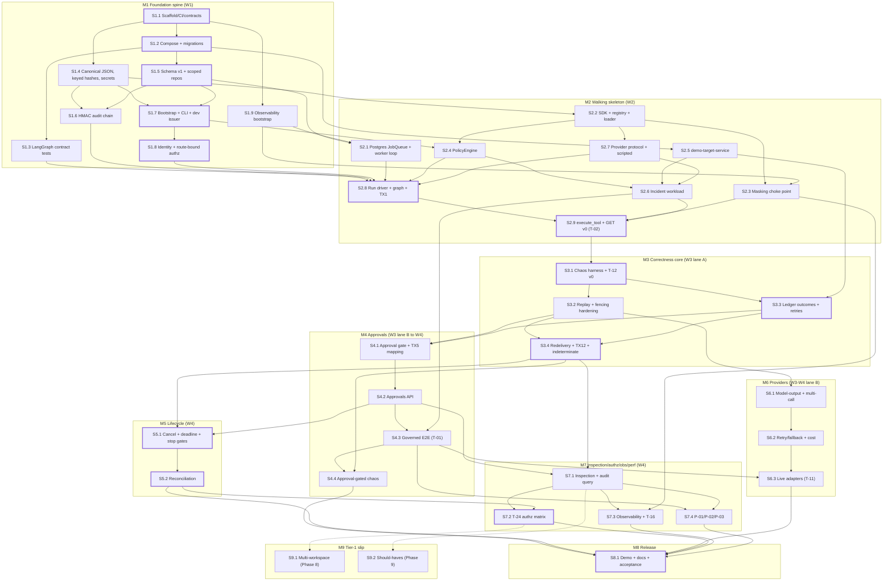

# Implementation Plan: Tether V1 — Governed Agent-Execution Runtime (Reference Slice)

## 1. Header

- **Title:** Tether V1 reference slice — implementation plan
- **Source PRD:** `.claude/PRPs/prds/tether-runtime.prd.md` (frozen V1 requirements baseline)
- **Architecture:** `docs/architecture/tether-v1-architecture.md` (revised after architect review)
- **ADR index:** `docs/adr/README.md` (ADR-0001 … ADR-0017, all `accepted`)
- **Scope:** Full V1 reference slice (PRD Phases 1–7 and 10 in the base schedule; Phases 8–9 are tier-1 slip candidates)
- **Complexity:** Large
- **Status:** Approved — active implementation plan

## 2. Summary

This plan builds Tether V1 as a dependency-ordered sequence of 38 PR-sized steps for one developer driving AI coding agents in two lanes. It sets up the data, identity and audit spine in week 1. It reaches a walking skeleton by the end of week 2: authenticated submit, LangGraph run driver, scripted model, read tool in the worker, HMAC audit, and `GET` run inspection. It then hardens the riskiest correctness mechanisms with chaos tests in weeks 2–3: `durability="sync"` replay with hash-checked create-or-get, queue leasing and the wake protocol, advisory lock plus fencing, and the ledger with TX5/TX6/TX7/TX12. Approvals, cancellation, reconciliation, providers, inspection, the authorization matrix and performance follow in weeks 3–4. Every step names the PRD test IDs it closes, the §22 invariants it establishes and the TX1–TX12 transactions it touches. Tier-1 and tier-2 scope cuts are pre-ordered, and no step schedules cutting a non-slippable guarantee.

## 3. Prerequisite decisions before coding

### 3.1 PRD open questions that block specific steps

| ID | PRD open question | Needed by step | Recommended default (confirm at step) | How earlier steps proceed without it |
|----|-------------------|----------------|----------------------------------------|---------------------------------------|
| PQ-1 | Hosted provider: Anthropic or OpenAI | S6.3 | Anthropic Messages API, small/fast model tier — **owner decision, confirm by D15 (before S6.3)** | Everything up to S6.2 uses the vendor-neutral `ModelProvider` protocol and the test-only scripted provider; no step before S6.3 imports a vendor SDK |
| PQ-2 | Default primary vs fallback | S6.3 (config), S8.1 (demo) | Demo: hosted primary → Ollama fallback (reasoning reliability; fallback is free). CI: scripted-primary/scripted-secondary pair — **confirm at S6.3** | Config-only by ADR-0016; T-10 scripted variants need no real providers |
| PQ-3 | Ollama model for multi-step tool calling | S6.3 / T-11 | Time-boxed (≤2 h) spike in week 3 (lane B) comparing tool-capable 7–14B instruct models (e.g. a Qwen-family instruct model and `llama3.1:8b`); pick the first that completes the `happy_path_config` flow 3/3 times — **confirm at S6.3** | Scripted provider for all deterministic tests; the Ollama container exists from S1.2, but its model is pulled only by the `live` compose profile |
| PQ-4 | Model-pricing source | S6.2 | Static, version-controlled `config/pricing.yaml` (per provider/model price per 1M input/output tokens, with `as_of` date and a source note; Ollama = 0) — **confirm at S6.2** | `model_calls.cost_usd` is nullable until S6.2; T-12 checks cost presence only from S6.2 onwards |
| PQ-5 | Data retention | None in the slice | No deletion or cleanup jobs; README states "demo/non-production only until retention is decided" (S8.1) | Not blocking |
| PQ-6 | Optional real external integration | Post-slice | None | Not blocking |
| PQ-7 | Inline human override semantics | S9.2 only | Do not build without a PRD revision of its design | Not blocking |
| PQ-8 | User/customer validation | Ongoing | Out of plan scope | Not blocking |

### 3.2 Architecture §25 planning questions (and ADR-delegated details), resolved

Every row below is a **recommended default — confirm at the named step**. None of them contradicts an ADR: polling only (ADR-0004), no Redis or broker (ADR-0001), independent key purposes (ADR-0010), no admin API (ADR-0014).

| ID | Question | Recommended default | Confirm at |
|----|----------|---------------------|-----------|
| PD-1 | Language/runtime | Python 3.12; Postgres 16; `uv` for env and lockfile | S1.1 |
| PD-2 | DB driver | `psycopg` 3 (async) + `psycopg_pool`. This is the same driver the LangGraph Postgres saver uses, so there is one driver for everything | S1.2 |
| PD-3 | Query layer | SQLAlchemy 2.0 **Core** (no ORM) over psycopg. Correctness-critical transaction statements (SKIP LOCKED, conditional updates, `clock_timestamp()`) are explicit, reviewed SQL `text()` statements in the owning module, one function per TX ID | S1.5 |
| PD-4 | Migration tool and coexistence with the LangGraph saver | Alembic manages the `tether` schema. The LangGraph saver's own `setup()` manages the `langgraph` schema (connection `search_path=langgraph`). Both run in the one-shot `migrate` container. No cross-schema FKs. Tether never writes `langgraph` | S1.2 / S1.3 |
| PD-5 | JWT library | `PyJWT[crypto]`. Algorithms pinned per issuer in bootstrap (default EdDSA/Ed25519, RS256 allowed by config, `none` never). `exp`/`nbf` leeway 10 s | S1.8 |
| PD-6 | Structured logging | `structlog` JSON renderer bridged to stdlib logging. A redaction processor plus a secret-value scrubber registry | S1.9 |
| PD-7 | Import-contract tool | `import-linter` (forbidden contracts `tether → workloads`; workloads may import only `tether.sdk`) plus an AST/grep pytest for "no references" (T-14) | S1.1 |
| PD-8 | Test framework | `pytest`, `pytest-asyncio`, `httpx` (ASGI transport for API tests), `hypothesis` for canonicalisation/hash properties. Per-test database cloned from a migrated template DB (`CREATE DATABASE … TEMPLATE`) for isolation | S1.1 / S1.5 |
| PD-9 | Lint/type/task runner | `ruff` (lint + format), `mypy --strict` on `src/`, `poethepoet` tasks (`uv run poe <task>`), which works cross-platform on the Windows dev host | S1.1 |
| PD-10 | Other libraries | FastAPI + uvicorn; Pydantic v2 + pydantic-settings; `httpx`; `rfc8785` (JCS); Typer (CLI); PyYAML `safe_load` (bootstrap); `opentelemetry-sdk` + OTLP exporter | S1.1 |
| PD-11 | Lease duration / heartbeat | Lease 30 s for every job kind. Heartbeat every 10 s extends the lease. A lost lease or a lock-connection error aborts the invocation. Chaos override: lease 3 s, heartbeat 1 s | S2.1 |
| PD-12 | Polling interval | 250 ms ± 50 ms jitter (polling only, ADR-0004). Advisory-lock contention requeue delay 250–500 ms **without consuming an attempt** | S2.1 |
| PD-13 | Backoff | Tools: base 0.5 s, ×2, cap 5 s, full jitter. Providers: base 1 s, ×2, cap 8 s, full jitter; honour `Retry-After` up to 30 s | S3.3 / S6.2 |
| PD-14 | Max attempts | Ledger send attempts (shared by in-delivery retries and redeliveries): descriptor default 3. `jobs.max_attempts`: `advance_run` 8, `execute_tool` 5, timers 10. Provider attempts per turn: primary 3, secondary 2 | S2.1 / S3.3 / S6.2 |
| PD-15 | Max steps; repair/denial budget | `max_steps` = 20 governed calls per run; `max_turns` = 15. Repair budget 3 and denial budget 3, counted separately per run | S6.1 |
| PD-16 | Token-estimation safety margin | Estimate = ceil(UTF-8 chars / 3) over the rendered history + manifest. Fits only if estimate + `max_output_tokens` ≤ 0.85 × `context_window_tokens` | S6.2 |
| PD-17 | Timeouts | Tool default 10 s (descriptor). Provider request 60 s hosted / 120 s Ollama | S3.3 / S6.3 |
| PD-18 | Status enum names | Run: `queued, running, awaiting_approval, awaiting_tool, awaiting_reconciliation, succeeded, failed, cancelled, timed_out, abandoned`. Ledger: `pending, dispatched, completed, failed, indeterminate, abandoned`; resolution `automatic, reconciled_applied, reconciled_not_applied, reconciled_abandon`. Approval: `pending, approved, rejected, expired, closed`. Job: `ready, leased, done, dead`. Tool-result outcomes per AD-06 + `skipped` | S1.5 |
| PD-19 | API shapes | Routes: `POST /v1/tasks/runs`, `GET /v1/tasks/runs/{id}`, `POST /v1/tasks/runs/{id}/cancel`; `GET /v1/approvals/approvals`, `GET /v1/approvals/approvals/{id}`, `POST …/{id}/approve`, `POST …/{id}/reject`, `GET /v1/approvals/runs/{id}`; `GET /v1/ops/runs/{id}`, `GET /v1/ops/audit`, `POST /v1/ops/ledger/{id}/reconcile`, `POST /v1/ops/runs/{id}/cancel`; unauthenticated `/healthz`, `/readyz` (no data). Timeline = run header (status, stop flags, requester, agent, outcome summary, chain-verified flag) + steps (ordinal, tool, version, keyed hash, masked args, decision, approval, ledger state/attempts/resolution, outcome) + model calls (turn, provider, model, attempt, status, tokens, cost) + ordered audit events + cost summary per provider. Audit query: filters `run_id, actor, tool, approver, from, to`; keyset cursor on `(created_at, run_id, seq)`; limit 100 default, 500 max | S2.9 / S4.2 / S7.1 |
| PD-20 | API-key hashing, issuance, rotation | Format `tak_<key_id>_<32-byte base32 secret>`. Store `key_id`, 16-byte salt, SHA-256(salt ‖ secret); constant-time compare. Issue with `tether apikey new`, which prints the raw key once plus the bootstrap hash line. Rotate by overlap: add the new key → apply → move callers → remove the old key → apply | S1.7 |
| PD-21 | Key scheme for audit and call-binding keys | Two **independent** 32-byte random secret families with key IDs, supplied through `SecretsProvider` (`TETHER_AUDIT_KEY_<ID>`, `TETHER_BINDING_KEY_<ID>`, active IDs in env). No derivation from a shared master, which keeps rotations decoupled per ADR-0010. If a master is adopted later: HKDF-SHA-256 with distinct labels `tether/v1/audit` and `tether/v1/call-binding`. Rotation runbook in S8.1 | S1.4 |
| PD-22 | LangGraph version pinning | Exact pins for `langgraph` and `langgraph-checkpoint-postgres` (current stable at S1.3 that exposes `durability="sync"`). Bumps only with the S1.3 contract suite green | S1.3 |
| PD-23 | Scripted-provider scenario format | YAML under `workloads/<w>/scenarios/` (and `tests/fixtures/…`). Fields: scenario `name`; ordered `turns`. Each turn is one of: tool calls (tool + arguments, optional untrusted rationale text), final answer, or malformed call (raw invalid payload). Optional per-turn fault directives keyed by provider role and attempt number (timeout, 5xx, 429, latency ms). The provider is a **pure function** of (scenario, turn index derived from history, provider role, attempt number passed in settings), so crash replays get identical responses. The scenario is selected by a `#scenario=<name>` marker in the first user message, read only by the scripted provider | S2.7 |
| PD-24 | Chaos harness mechanism | Deterministic **in-process fault points** (`tether.testing.faults`) that call `os._exit(137)` at named points, active only when `TETHER_ENV=test` and the point is listed in `TETHER_FAULT_POINTS`. A pytest **process supervisor** starts the api and worker (1–2 replicas) as real subprocesses against the test Postgres and demo-target containers, kills them, and restarts them without the fault env. Waits poll DB state, never sleep. Lease expiry is forced with short leases plus target latency. Chaos runs on Linux (CI or the compose test container) | S3.1 |
| PD-25 | Pricing table | See PQ-4 | S6.2 |
| PD-26 | Ollama model and pre-pull | See PQ-3. A compose `ollama-pull` one-shot service in the `live` profile pulls into the model volume; live tests skip with a clear message if the model is absent | S6.3 |
| PD-27 | `demo-target-service` API shape and key retention | FastAPI app with its own `demo_target` database. `GET /health` (status, error rate); `GET /logs?since&limit`; `GET /config` (`config_version`, values, `db_password`); `POST /restart` and `POST /config` (body includes `expected_config_version`), both requiring an `Idempotency-Key` header. Same key + same body → stored original response. Same key while in progress → `409 in_progress`. Same key + different body → `422`. Precondition mismatch → `409 precondition_failed` with current version and no change. Admin (internal network and test only): `/_admin/faults` (unhealthy, fail_n 5xx, timeout_n, latency_ms, apply_then_delay), `/_admin/reset`, `/_admin/counters` (applied counts per endpoint), `/_admin/inflight`, `/_admin/scenario/{name}` (e.g. adversarial logs). Idempotency records are retained durably (no expiry) and cleared only by reset | S2.5 |
| PD-28 | JCS integer range; preconditions | The SDK rejects floats in write-tool argument schemas and integers outside ±(2^53−1). Preconditions are declared as a subset of argument field names | S1.4 / S2.2 |
| PD-29 | Advisory-lock connection management | `pg_try_advisory_lock(bigint)` with key = signed 64-bit value from the first 8 bytes of SHA-256(`tether.run:` + run_id); collisions cause only spurious, safe contention. Dedicated connection from a separate lock pool (size = worker concurrency). The heartbeat checks the lock connection and extends the lease every 10 s. Released in `finally` and on session close | S2.8 |
| PD-30 | Lease-token handling in TX7 | The outcome UPDATE is conditional only on `state='dispatched'`. The job-completion UPDATE, in the same transaction, is conditional on `lease_token`; zero rows is tolerated and never rolls back the outcome | S2.9 |
| PD-31 | Policy-activation lock order (ADR-0009 risk) | Global lock order: run row → `policy_versions` row (FOR SHARE) → approval/ledger row → audit head → jobs. Bootstrap activation locks only `policy_versions` rows (FOR UPDATE), so it cannot form a cycle | S2.4 |
| PD-32 | Worker concurrency | 4 concurrent jobs per worker process; replicas: 1 in dev, 2 in chaos (C-07) | S2.1 |
| PD-33 | Write tool reporting `applied` with schema-invalid output (T-09 for writes; behaviour not specified upstream) | Ledger `completed` (the effect occurred). History receives `applied` with an `output_invalid` marker and no payload; the invalid output is never persisted or shown to the model. Read tools with invalid output → typed failure (no retry) | S3.3 |
| PD-34 | Per-test overrides | Approval expiry and max run duration are overridable per workspace/tool in bootstrap; overrides are included in the policy-version content hash. Lease and heartbeat are overridable by env in test only | S1.7 / S4.1 |
| PD-35 | Run status after `advance_run` TX12 with an in-flight (non-terminal) ledger entry (gap; see §15) | The run driver may conditionally move `awaiting_reconciliation → awaiting_tool/running` when a later wake finds the blocking entry has reached a terminal state automatically. This is still a single-writer, fenced, conditional transition. Record it as a clarification note on ADR-0006 before S3.4 merges | S3.4 |
| PD-36 | CI | GitHub Actions. Every push: static job (lint, type, contracts, unit). Pull requests: integration + authz. Chaos: on PRs touching `runtime/ledger/queue/worker/approvals/reconciliation`, plus nightly. Perf: nightly + pre-release. Live provider tests: manual dispatch only | S1.1 |

## 4. Patterns to Mirror

**There is no existing code to mirror.** The repository contains only `README.md`, the PRD, the architecture document and the ADRs. The patterns below are **mandated by the architecture and ADRs**. Items marked *(to establish)* are conventions this plan introduces; they are not codebase precedent.

**Mandated patterns (architecture / ADRs):**
- **Write/wait node discipline** (ADR-0003). Write nodes create authoritative rows and never interrupt. Wait nodes only read and call `interrupt()` while unsatisfied, checking before interrupting and looping on spurious wakes.
- **Create-or-get by deterministic key with call-hash comparison** on every get; a mismatch means `REPLAY_DIVERGENCE`, fail closed (ADR-0003).
- **Ledger-first** (ADR-0003). Once a ledger row exists, no policy, hash or stop re-check runs for that call.
- **Single transaction = state change + critical audit + wake/enqueue** (ADR-0001/0004/0015), in the lock order run → policy_version → approval/ledger → audit head → jobs.
- **Conditional updates** (`WHERE state = :expected`) for every lifecycle/ledger transition; time comparisons use DB `clock_timestamp()` only (ADR-0006).
- **Fenced driver writes.** Every run-driver transaction asserts `driver_generation` under the run-row lock (ADR-0005).
- **Workspace-scoped repositories.** No raw sessions in request handlers; out-of-scope access returns 404 (ADR-0013).
- **Route-bound audiences.** The expected `aud` comes from the router (ADR-0013).
- **Masking at the source.** The sanitizer runs before TX7. Nothing logs graph state or job payloads (ADR-0017).
- **Audit dedupe classes**: decision events are create-or-get and adopted on replay; observation events use per-occurrence keys (ADR-0015).
- **Typed results, not exceptions,** for model-facing outcomes (ADR-0012/0016).
- **Only `tether.sdk` is visible to workloads** (ADR-0002).

**Conventions to establish:**
- *(to establish)* Module layout exactly per architecture §4. Process settings live in `src/tether/settings.py` (the only addition to the §4 tree).
- *(to establish)* One function per catalogue transaction, named for its purpose and tagged with its TX ID in the docstring (e.g. "TX6"), so `grep TX6` finds the implementation. All SQL lives in `storage/` or the owning module's `repo.py`/`tx.py`.
- *(to establish)* The audit event-type registry in `tether.audit.events` declares each type's class (decision/observation) and its dedupe-key builder; ad-hoc event types are not allowed.
- *(to establish)* Error mapping: `401` (credential), `404` (out of scope / not eligible to see), `409` (state conflict), `422` (validation), `503` (policy-version mismatch). Never `403`.
- *(to establish)* Test layout `tests/{unit,integration,authz,chaos,perf,architecture,contract}`. Test names embed PRD IDs (e.g. `test_T01_…`, `test_C04_…`). Markers `live`, `chaos`, `perf`. The T-12 reconstructability fixture is autouse in integration and chaos.
- *(to establish)* Fault-point names follow `<component>.<moment>` (e.g. `worker.after_tx6`, `driver.node_end.authorize_call`).
- *(to establish)* One plan step per PR. PR title prefixed with the step ID (e.g. `S3.3:`). Conventional commits. Any deviation from an accepted ADR needs a superseding ADR **before** the code merges.
- *(to establish)* Review checklist for runtime PRs: fenced? create-or-get with hash compare? wake inserted? `clock_timestamp()`? masked before persist? scoped repository?

## 5. Milestone overview

| Milestone | Steps | PRD phases | Target week | Exit demo |
|-----------|-------|-----------|-------------|-----------|
| M1 Foundation spine | S1.1–S1.9 | 1 (+4 risk spike) | W1 | `docker compose up` healthy from bootstrap (incl. `fixture-b`); T-18 JWT cases, T-13 and LangGraph contract tests green |
| M2 Walking skeleton | S2.1–S2.9 | 2, 3, 4, 10 (+7 v0) | W2 | `poe smoke`: HTTP submit → scripted model → 4 reads in the worker → audit chain → `GET /v1/tasks/runs/{id}` = `succeeded` (T-02) |
| M3 Correctness core and early chaos | S3.1–S3.4 | 6 (+4, 7) | W3 (lane A) | C-01, C-02, T-03, T-04, T-09, T-17 green; replay/fencing suite green 20× |
| M4 Approvals | S4.1–S4.4 | 5, 6, 10 | W3 (lane B) → W4 | T-01 happy path; C-03–C-07, T-20, T-21 green |
| M5 Lifecycle | S5.1–S5.2 | 6 (+4 lifecycle) | W4 | T-25, T-26 green |
| M6 Model output and providers | S6.1–S6.3 | 4 | W3–W4 (lane B) | T-22, T-10 (scripted), T-11 green |
| M7 Inspection, authz, observability, performance | S7.1–S7.4 | 7 | W4 | T-12 full suite, T-24, T-16, P-01 green |
| M8 Release | S8.1 | 10 (+all) | W4 end | `poe demo` end to end; §12 Definition of Done checked |
| M9 Tier-1 slip | S9.1–S9.2 | 8, 9 | Only if ahead | Second real workspace; minimal approval UI |

## 6. Dependency graph

Thick borders mark the critical path. Dotted edges lead to tier-1 slip steps.

## 7. Detailed steps

Size key: **S** ≈ 0.5 day, **M** ≈ 1 day, **L** ≈ 2 days. Model tier: **strongest** for correctness-critical steps, **default** otherwise.

---

### M1 — Foundation spine

#### S1.1 — Repository scaffold, toolchain, CI, import contracts
- **PRD phase:** 1 (T-14 groundwork for 10)
- **Goal:** A real but empty package layout per §4, with lint, type, test and import-contract tooling green in CI, so every later step lands inside a checked structure.
- **Depends on:** —
- **Scope:**
  - CREATE `pyproject.toml` (uv; dependency groups `dev`, `live`; entry-point group `tether.workloads`; poe tasks; import-linter contracts; ruff/mypy config), `uv.lock`, `.python-version`, `.gitattributes` (LF for scripts), `.gitignore` (incl. `tools/dev_issuer/.keys/`)
  - CREATE `src/tether/{sdk,core,identity,authz,policy,registry,providers,runtime,ledger,approvals,reconciliation,audit,queue,secrets,storage,observability,api,worker,cli,testing}/__init__.py`, `src/tether/settings.py`
  - CREATE empty `workloads/incident_remediation/`, `services/demo_target_service/`, `tools/dev_issuer/`, `config/bootstrap/`, `deploy/compose/`, `tests/{unit,integration,authz,chaos,perf,architecture,contract}/`
  - CREATE `tests/architecture/test_T14_domain_independence.py`, `.github/workflows/ci.yml`
- **Key decisions honoured:** ADR-0002; AD-02; PD-1, PD-7, PD-8, PD-9, PD-36.
- **Invariants:** 18 (check exists from day 1).
- **Transactions:** —
- **Tests to write first:** T-14 has three parts:
  - import-linter forbidden contracts;
  - an AST/grep test that `src/tether/` has no workload references (denylist: `workloads`, `incident`, `runbook`, the six demo tool names, `demo_target`, `ops-demo`);
  - a negative self-test (temporary module with a forbidden import) proving the checker fails.
- **Validation / exit:** `uv run poe lint`, `poe typecheck`, `poe contracts` and `poe test-unit` green locally and in CI.
- **Risk / slip:** Low / never.
- **Size / model:** S / default.

#### S1.2 — Compose stack, settings, migration framework
- **PRD phase:** 1
- **Goal:** `docker compose up` brings up Postgres (Tether and `demo_target` databases; `tether` and `langgraph` schemas; app and migrator roles), the one-shot `migrate`, `api`/`worker` with health endpoints, Ollama, the OTel collector and Jaeger.
- **Depends on:** S1.1
- **Scope:**
  - CREATE `Dockerfile` (one image; entrypoints `api`, `worker`, `migrate`, `cli`)
  - CREATE `deploy/compose/docker-compose.yml` (postgres, migrate, api, worker, ollama, otel-collector, jaeger, demo-target placeholder; `live` profile for `ollama-pull`), `deploy/compose/docker-compose.test.yml` (postgres + demo-target for CI/tests), `deploy/compose/otel-collector.yaml`, `deploy/compose/postgres/init.sql` (databases, schemas, roles `tether_migrator`, `tether_app`)
  - CREATE `alembic.ini`, `src/tether/storage/{engine.py, migrations/env.py}`, `src/tether/api/app.py` (`/healthz`, `/readyz`), `src/tether/worker/main.py` (idle loop), `src/tether/cli/main.py` (`tether migrate`)
- **Key decisions honoured:** ADR-0001 (one image, two entrypoints, Postgres only); §18 (migrate container); §19; PD-2, PD-4.
- **Invariants:** enables 17.
- **Transactions:** —
- **Tests to write first:** `tests/integration/test_compose_smoke.py`: migrate exits 0 and is idempotent; `/readyz` 200; both schemas exist; `tether_app` cannot run DDL.
- **Validation / exit:** `uv run poe smoke` reports every service healthy.
- **Risk / slip:** Docker Desktop on Windows (line endings, volume paths), mitigated by `.gitattributes` and Linux CI / never.
- **Size / model:** M / default.

#### S1.3 — LangGraph semantics contract tests and version pin (risk spike)
- **PRD phase:** 4 (pulled forward)
- **Goal:** Before any runtime code depends on them, prove against the pinned LangGraph and Postgres saver the exact semantics that ADR-0003/0005 rely on.
- **Depends on:** S1.2
- **Scope:**
  - CREATE `src/tether/runtime/checkpointer.py` (saver factory on `langgraph` schema; connection settings per saver docs, verify autocommit/row-factory requirements)
  - CREATE `tests/contract/langgraph/{test_durability_sync.py, test_interrupt_resume.py, test_crash_resume.py, test_state_inspection.py, README.md}`
  - UPDATE `pyproject.toml` (exact pins); UPDATE `migrate` to run the saver `setup()`
- **Key decisions honoured:** ADR-0003 (sync durability, re-run from node start, payloads meaningless); ADR-0005 (invocation choice); §9.3; PD-4, PD-22.
- **Invariants:** 21, 24 (contract level).
- **Transactions:** —
- **Tests to write first (contract):**
  - (a) under `durability="sync"`, a node observes the previous step's checkpoint already committed (read through an independent connection);
  - (b) `interrupt()` → resume re-executes the node from its first line;
  - (c) a resume carrying no meaning works. Verify `Command(resume=None)`; if `None` is not a valid resume, adopt a constant sentinel value and record that in the README;
  - (d) a subprocess `os._exit` mid-node → `invoke(None)` on the same thread re-runs that node from the last checkpoint;
  - (e) state inspection distinguishes the four §9.3 step-3 branches (no checkpoint / pending interrupt / non-empty `next` without interrupt / finished);
  - (f) saver tables exist only in `langgraph` (covered by `tests/integration/test_compose_smoke.py`). *Moved to S1.5 (2026-10-08):* "Alembic autogenerate ignores them". Autogenerate cannot run until the migration environment has `target_metadata`, which first exists in S1.5; an empty-`MetaData` stand-in would not exercise the real `env.py` configuration.
- **Validation / exit:** contract suite green on the pinned versions; invocation-choice mapping documented in the test README.
- **Risk / slip:** **High impact.** If (a)–(e) fail, ADR-0003's premises fail: stop and raise a superseding ADR before S2.8 / never.
- **Size / model:** M / strongest.

#### S1.4 — Core primitives: canonical JSON, keyed hashes, idempotency keys, SecretsProvider, key ring
- **PRD phase:** 1–2
- **Goal:** Pure, property-tested crypto and secrets building blocks.
- **Depends on:** S1.1
- **Scope:**
  - CREATE `src/tether/core/{ids.py, canonical.py (RFC 8785 via rfc8785; integer-range and float guards), hashing.py (envelope v1 → HMAC-SHA-256 call_hash; AD-09 idempotency key), errors.py, results.py (neutral outcome enums)}`
  - CREATE `src/tether/secrets/{provider.py (SecretsProvider protocol, SecretValue with masked repr), env_provider.py, keyring.py (audit and binding key families, key IDs, active IDs)}`
- **Key decisions honoured:** ADR-0010 (envelope fields, keyed hash, distinct key purposes); ADR-0008 (key derivation, computed once); ADR-0017; PD-21, PD-28.
- **Invariants:** 15, 34 (primitives), 6 (key derivation).
- **Transactions:** —
- **Tests to write first (unit):**
  - RFC 8785 test vectors;
  - changing tool, tool version, any argument or any precondition changes the hash (T-08 unit level); call_id and rationale do not;
  - different binding key IDs → different hashes; same inputs → same hash in a fresh subprocess;
  - floats and integers beyond ±(2^53−1) rejected for write envelopes;
  - idempotency-key encoding is unambiguous (tuple boundaries cannot collide);
  - `SecretValue` never appears in `repr`, `str` or log output;
  - a missing pinned key raises a typed `KeyUnavailable`.
- **Validation / exit:** unit suite green; `mypy --strict` clean on `core` and `secrets`.
- **Risk / slip:** Medium (subtle crypto/encoding) / never.
- **Size / model:** M / strongest.

#### S1.5 — Tether schema v1, Unit of Work, workspace-scoped repositories
- **PRD phase:** 1
- **Goal:** All authoritative tables with the constraints from §11–§18, the terminal-status guard, append-only grants, and a UoW/repository layer that cannot be built without a `WorkspaceScope`.
- **Depends on:** S1.2
- **Scope:**
  - CREATE migration `0001_core_schema` with these tables:
    - `workspaces`, `issuers`, `api_keys`, `agents`, `policy_versions` (partial unique: one active per workspace);
    - `runs` (requester_snapshot, status, outcome_summary, cancel_requested_at/by, deadline_at, deadline_exceeded_at, driver_generation, binding_key_id, trace_parent);
    - `approvals` (UNIQUE(run_id, step_ordinal));
    - `ledger_entries` (UNIQUE(run_id, step_ordinal), UNIQUE(idempotency_key));
    - `audit_heads`, `audit_events` (UNIQUE(run_id, seq), UNIQUE(run_id, dedupe_key), AD-12 indexes);
    - `jobs` (index on state/run_after), `model_calls`, `access_events`.
  - The same migration adds the trigger `runs_status_terminal_guard` and grants that give `tether_app` no UPDATE/DELETE on `audit_events`.
  - CREATE `src/tether/storage/{uow.py, scope.py, repos/base.py}`, `src/tether/core/statuses.py` (PD-18 enums).
- **Key decisions honoured:** ADR-0013 (scoped repositories), ADR-0006 (terminal guard), ADR-0015 (append-only), ADR-0007 (ledger shape), ADR-0004 (job shape); PD-3, PD-8, PD-18.
- **Invariants:** 8 (DB guard), 13 (construction-time scope), 29 (convention + static check).
- **Transactions:** schema for TX1–TX12.
- **Tests to write first (integration):**
  - the trigger rejects a status change from each terminal status but allows other columns;
  - every unique constraint holds;
  - `tether_app` UPDATE/DELETE on `audit_events` → permission denied;
  - building a repository without a scope fails;
  - a cross-workspace lookup returns not-found;
  - static test: no `now()` in SQL anywhere under `src/tether`;
  - *moved from S1.3 (f), 2026-10-08:* Alembic autogenerate, with the real `target_metadata` and `env.py` configuration, proposes no changes for the LangGraph saver tables in the `langgraph` schema.
- **Validation / exit:** migration runs from an empty DB; the template-DB clone fixture works; tests green.
- **Risk / slip:** Schema churn, mitigated by additive migrations only / never.
- **Size / model:** M / strongest.

#### S1.6 — Per-run HMAC audit chain and verify CLI
- **PRD phase:** 1
- **Goal:** Append critical events inside the caller's transaction under the head lock, with dedupe classes; verify chains; fail closed.
- **Depends on:** S1.4, S1.5
- **Scope:** CREATE `src/tether/audit/{events.py (type registry with class and dedupe-key builder), chain.py (genesis, append), verify.py}`, `src/tether/cli/audit.py` (`tether audit verify --run|--workspace`).
- **Key decisions honoured:** ADR-0015; AD-12; §13.3 dedupe classes.
- **Invariants:** 7, 27 (dedupe mechanics), 17 (partial).
- **Transactions:** provides the append used by TX1–TX12.
- **Tests to write first:**
  - **T-13:** modifying a payload, reordering two events, or altering a `seq` in one run makes that run fail verification while other runs still verify. Tail truncation is asserted as *not detected* (documented limit).
  - Decision-class duplicate append returns the existing row; observation events with distinct occurrence keys are both stored.
  - An injected append failure rolls back the enclosing transaction (fail closed); a missing audit key aborts the transaction.
  - The MAC covers `workspace_id`; a DB scan finds no key bytes.
- **Validation / exit:** T-13 green; `tether audit verify` exits non-zero on a tampered run.
- **Risk / slip:** Low (contention is per run only) / never.
- **Size / model:** M / strongest.

#### S1.7 — Bootstrap configuration, CLI apply, dev issuer, fixture workspaces
- **PRD phase:** 1
- **Goal:** Declarative YAML applied to Postgres idempotently and transactionally; policy versions recorded and activated; dev tokens mintable; `ops-demo` and `fixture-b` defined.
- **Depends on:** S1.4, S1.5
- **Scope:**
  - CREATE `src/tether/cli/{bootstrap.py (validate, apply), apikey.py}`, `src/tether/policy/versioning.py` (content hash of declarative policy + overrides; extended in S2.4)
  - CREATE `config/bootstrap/{dev.yaml, test.yaml}`:
    - `ops-demo`: separate tasks/approver/ops issuers (public keys only); API key bound to `incident-remediator`; per-tool/workspace overrides (PD-34);
    - `fixture-b`: its own issuer, key and agent.
  - CREATE `tools/dev_issuer/{keys.py, mint.py}` (keypairs; tokens for alice, bob, carol, dave, erin, frank, mallory with correct `aud`, `workspace`, roles).
- **Key decisions honoured:** ADR-0014; ADR-0009 (one active version per workspace); ADR-0013 (platform-controlled issuers, private keys outside the image); PD-20, PD-34.
- **Invariants:** 11 (policy only from config), 13 (workspace-scoped records).
- **Transactions:** —
- **Tests to write first:**
  - applying twice → no changes;
  - an invalid file → non-zero exit and an untouched DB (transactional);
  - a policy change → new active version, old version inactive, exactly one active per workspace;
  - raw API keys are never stored;
  - bootstrap rejects any private key material.
- **Validation / exit:** the `migrate` container runs apply; dev tokens are accepted by S1.8.
- **Risk / slip:** Low / never.
- **Size / model:** M / default.

#### S1.8 — Identity and route-bound authorization framework
- **PRD phase:** 1
- **Goal:** Full JWT and API-key validation producing `Principal`/`CallerApp`; routers statically bound to audiences; `401` before anything else; `404` for out-of-scope.
- **Depends on:** S1.7
- **Scope:**
  - CREATE `src/tether/identity/{jwt.py, issuer_keys.py (StaticIssuerKeyProvider), api_keys.py, principal.py}`
  - CREATE `src/tether/authz/{audiences.py, deps.py, rules.py (endpoint rule table, filled per step), errors.py}`
  - CREATE `src/tether/api/routers/{tasks.py, approvals.py, ops.py}` (skeletons plus a test-only probe route mounted only when `TETHER_ENV=test`)
- **Key decisions honoured:** ADR-0013; AD-03; PD-5.
- **Invariants:** 12, 13.
- **Transactions:** —
- **Tests to write first:**
  - **T-18 JWT cases:** bad signature, wrong `iss`, wrong `aud`, expired, future `nbf`, missing `sub`, missing or mismatched workspace claim, `alg=none`, non-pinned alg, roles supplied outside the token are ignored, unknown or revoked API key. Each → `401`, with zero audit rows, zero policy calls and zero jobs.
  - Cross-audience reuse (approvals token on a tasks route, ops token on an approvals route, and so on) → `401` (groundwork for T-19/T-24).
- **Validation / exit:** the JWT and API-key cases of T-18 are green. The agent-binding case is closed in S2.8.
- **Risk / slip:** Medium (security-critical) / never.
- **Size / model:** M / strongest.

#### S1.9 — Observability bootstrap
- **PRD phase:** 1
- **Goal:** JSON logs correlated by `run_id`/`trace_id` with redaction; OTLP tracer and meter; traceparent helpers for persistence.
- **Depends on:** S1.1 (S1.2 for the collector)
- **Scope:** CREATE `src/tether/observability/{logging.py, tracing.py, metrics.py}`; UPDATE `settings.py` (LangSmith/LangChain tracing forced off).
- **Key decisions honoured:** ADR-0015 (telemetry best-effort), ADR-0017 (scrubber); PD-6.
- **Invariants:** 14 (log/trace sinks), 17.
- **Transactions:** —
- **Tests to write first:**
  - bound `run_id`/`trace_id` appear on log lines;
  - a registered secret value is scrubbed from messages and fields;
  - payload/state keys are dropped by the processor denylist;
  - traceparent create/parse round-trips.
- **Validation / exit:** a probe request yields a JSON log line and a span visible in Jaeger (manual check).
- **Risk / slip:** Low / never (only polish slips; see S7.3).
- **Size / model:** S / default.

---

### M2 — Walking skeleton

#### S2.1 — Postgres JobQueue and worker loop
- **PRD phase:** 2
- **Goal:** An at-least-once queue with leases, heartbeats, delayed jobs, release without consuming an attempt, lease-token-conditional completion, and a dead-letter hook running in the same transaction; a worker loop dispatching by job kind.
- **Depends on:** S1.5, S1.9
- **Scope:** CREATE `src/tether/queue/{protocol.py (JobQueue), postgres.py, dead_letter.py (per-kind hook registry), backoff.py}`, `src/tether/worker/{loop.py, heartbeat.py, handlers/__init__.py}`; UPDATE `worker/main.py`.
- **Key decisions honoured:** ADR-0004 (polling only, no coalescing, bounded delivery), ADR-0001; PD-11, PD-12, PD-14, PD-32.
- **Invariants:** 23, 25 (framework), 29.
- **Transactions:** TX12 framework (domain branches in S3.4).
- **Tests to write first (integration):**
  - 20 concurrent leasers × 200 jobs → no job is held by two live leases;
  - an expired lease is re-leasable with `attempts+1`;
  - completing with a stale token updates 0 rows and raises no error;
  - a job enqueued in an uncommitted transaction is invisible;
  - a delayed job is not leased before `run_after` (`clock_timestamp()`);
  - release-without-attempt leaves `attempts` unchanged;
  - once `attempts > max_attempts`, the hook runs in the same transaction that marks the job `dead`, and a hook exception rolls both back;
  - heartbeat extends the lease;
  - duplicate wake jobs are both stored (no coalescing).
- **Validation / exit:** queue suite green; the worker idles at 250 ms polling.
- **Risk / slip:** Medium–high (core concurrency) / never.
- **Size / model:** L / strongest.

#### S2.2 — SDK, tool registry, ToolSource, manifest, workload loading
- **PRD phase:** 2, 10
- **Goal:** Define the public `tether.sdk` surface, and the registry that turns workload declarations into validated, versioned descriptors and a provider-neutral manifest. Workloads are loaded by entry point and fail closed.
- **Depends on:** S1.4
- **Scope:**
  - CREATE `src/tether/sdk/{__init__.py, tools.py, outcome.py (ToolOutcome.applied/not_applied), annotations.py (Sensitive), policy.py (rule API), agents.py}`
  - CREATE `src/tether/registry/{descriptor.py, source.py (ToolSource), native.py (NativePythonToolSource), registry.py (one offered version per name; older versions resolvable), manifest.py, loader.py}`
- **Key decisions honoured:** ADR-0002, ADR-0011 (offered vs resolvable versions; version-bump rule in SDK docs), ADR-0017, ADR-0010 (write-schema numeric rules); §7; PD-28.
- **Invariants:** 11, 18.
- **Transactions:** —
- **Tests to write first:**
  - a write descriptor with float fields, or without an idempotency declaration, is rejected;
  - preconditions must be a subset of the arguments;
  - generated models use `hide_input_in_errors` (error text contains no input values);
  - the manifest contains only offered versions and only agent-allowed tools;
  - an unknown or broken workload named in bootstrap fails startup;
  - T-14 stays green with a sample SDK-only workload.
- **Validation / exit:** registry suite green.
- **Risk / slip:** SDK scope creep: the surface is limited to types and registration and reviewed at this step / never.
- **Size / model:** M / default (SDK surface reviewed by strongest).

#### S2.3 — Masking choke point
- **PRD phase:** 2
- **Goal:** The sanitizer masks `Sensitive` output fields before persistence; arguments are masked for display; secrets are auto-registered with the scrubber.
- **Depends on:** S2.2, S1.9
- **Scope:** CREATE `src/tether/secrets/masking.py` (ToolResultSanitizer, ArgumentMasker); UPDATE `observability/logging.py` (register every SecretValue on access).
- **Key decisions honoured:** ADR-0017.
- **Invariants:** 14.
- **Tests to write first:** T-16 unit part:
  - nested and list `Sensitive` fields are masked;
  - the serialized sanitizer output contains no unmasked values;
  - display masking covers arguments and preconditions marked `Sensitive`;
  - a secret fetched through the provider never appears in captured logs.
- **Validation / exit:** sanitizer suite green.
- **Risk / slip:** A mislabelled field leaks. S7.3 sink scan is the backstop / never.
- **Size / model:** S / strongest.

#### S2.4 — PolicyEngine and built-in deny-by-default evaluator
- **PRD phase:** 3
- **Goal:** Three decision points, user × agent permission intersection, workload rules via the SDK, and a `policy_version` covering config + evaluator version + workload rule versions, checked against the active row inside decision transactions.
- **Depends on:** S2.2, S1.7
- **Scope:** CREATE `src/tether/policy/{engine.py, builtin.py, inputs.py, decisions.py, active_version.py}`; UPDATE `policy/versioning.py`; UPDATE `api`/`worker` startup (refuse on version mismatch; periodic re-check every 30 s).
- **Key decisions honoured:** ADR-0009; AD-05; PD-31.
- **Invariants:** 11, 31.
- **Transactions:** provides decision logic for TX2, TX4, TX5, TX8.
- **Tests to write first:**
  - **T-06 unit level:** decision table — unknown tool → deny; user missing permission → deny; agent missing permission → deny; user outside workspace → deny; low-risk read with permissions → allow; high-risk write → require_approval; evaluator exception → deny with reason.
  - Model-supplied risk or permission fields have no effect.
  - Eligibility methods receive both actor and requester.
  - A loaded version that differs from the active one → no decision recorded (typed mismatch).
- **Validation / exit:** exhaustive decision tests green.
- **Risk / slip:** Medium (security) / never.
- **Size / model:** M / strongest.

#### S2.5 — demo-target-service
- **PRD phase:** 10
- **Goal:** A controllable unhealthy service with durable idempotency records (including overlapping same-key requests), a config-version precondition, fault injection and write counters.
- **Depends on:** S1.2
- **Scope:** CREATE `services/demo_target_service/{app.py, store.py, faults.py, Dockerfile, tests/}`; UPDATE compose files.
- **Key decisions honoured:** PRD demo environment; ADR-0002 (Tether never imports it); PD-27.
- **Invariants:** — (enables C-04–C-07, T-21).
- **Tests to write first (service-local):**
  - a repeated key returns the original response and the counter is unchanged;
  - concurrent same-key requests → one apply, the other gets `409 in_progress` or the original response;
  - same key with a different body → `422`;
  - precondition mismatch → `409 precondition_failed` and config unchanged;
  - every fault mode is deterministic;
  - reset clears state.
- **Validation / exit:** service tests green; container healthy in compose.
- **Risk / slip:** Low / never (it underpins chaos tests).
- **Size / model:** M / default.

#### S2.6 — Incident-remediation workload (tools, agent, reference policy, scenarios v1)
- **PRD phase:** 10
- **Goal:** Register six tools, runbooks, the agent, and the reference policy (oncall; separation of duties for approval and reconciliation; agent permission sets) through `tether.sdk` only, plus the first scenarios.
- **Depends on:** S2.4, S2.5, S2.7
- **Scope:** CREATE `workloads/incident_remediation/{tools.py, policy.py, agent.py, client.py (forwards Idempotency-Key), runbooks/*.md, scenarios/{reads_only.yaml, happy_path_config.yaml, happy_path_restart.yaml}}`; UPDATE `pyproject.toml` (entry point); UPDATE `config/bootstrap/*.yaml`.
- **Key decisions honoured:** ADR-0002, ADR-0009 (separation of duties in workload policy), ADR-0011, ADR-0017 (`db_password` is `Sensitive`).
- **Invariants:** 11, 18.
- **Tests to write first:**
  - T-14 green with the real workload;
  - write schemas have no floats; `update_service_config` precondition = `expected_config_version`; `db_password` is `Sensitive`;
  - reference-policy unit table for alice, carol, bob, dave, and an agent without `service:restart` (pre-T-06).
- **Validation / exit:** api and worker start with the workload loaded; the active policy version includes the workload rule version.
- **Risk / slip:** Incident logic leaking into core, prevented by T-14 / never.
- **Size / model:** M / default.

#### S2.7 — Provider protocol, neutral history, scripted provider
- **PRD phase:** 4
- **Goal:** The `ModelProvider` protocol, capabilities, and neutral history models; a test-only scripted provider driven by YAML (PD-23).
- **Depends on:** S2.2
- **Scope:** CREATE `src/tether/providers/{protocol.py, history.py (outcomes incl. skipped), capabilities.py, settings.py (provider profiles)}`, `src/tether/testing/{__init__.py (env guard), scripted.py, scenario_schema.py}`.
- **Key decisions honoured:** ADR-0016, ADR-0012 (`skipped` outcome); PD-23, PD-34.
- **Invariants:** 19; 14 (history holds masked payloads by type).
- **Tests to write first:**
  - constructing the scripted provider with `TETHER_ENV≠test` raises; production provider config rejects `scripted`;
  - identical inputs → identical output in a fresh process;
  - fault directives per role and attempt are honoured; malformed and latency directives work.
- **Validation / exit:** scripted provider passes the protocol contract tests.
- **Risk / slip:** Low / never.
- **Size / model:** M / default.

#### S2.8 — Run driver, graph (allow path), submit API (TX1)
- **PRD phase:** 4 (+1 submit identity)
- **Goal:** Submit → `advance_run` → LangGraph graph with `durability="sync"`, driven by the wake protocol (lease → try-lock → generation increment → terminal check → invocation choice → heartbeat → release). Govern and authorize the `allow` path. `require_approval` fails closed until S4.1.
- **Depends on:** S1.3, S1.6, S1.8, S2.1, S2.4, S2.7
- **Scope:**
  - CREATE `src/tether/runtime/state.py`, `graph.py`, `driver.py`, `fencing.py` (DriverTx helper), `stop.py` (stop predicate SQL)
  - CREATE `src/tether/runtime/nodes/{gate.py, call_model.py (single attempt; stop check before and after), next_call.py, govern_call.py, authorize_call.py, await_tool.py, append_result.py, finalize.py, terminate.py}`
  - CREATE `src/tether/worker/handlers/{advance_run.py, run_deadline.py (stub completing as no-op until S5.1)}`
  - CREATE `src/tether/ledger/{repo.py, tx.py (TX5: insert pending + enqueue execute_tool only if the INSERT returned a row)}`
  - UPDATE `api/routers/tasks.py` (submit = TX1); `model_calls` row per attempt (usage; cost null)
- **Key decisions honoured:** ADR-0003, ADR-0005, ADR-0006 (single status writer; `queued` only in TX1), ADR-0010 (fenced pin of `binding_key_id` before the first hash), ADR-0013 (agent resolved from API key), ADR-0009 (version check in TX2/TX5); PD-29.
- **Invariants:** 2, 8, 10, 21, 24, 29, 30, 34; 1 (partial), 28 (TX2/TX5 `FOR SHARE`).
- **Transactions:** TX1, TX2 (basic), TX5 (allow path), TX11 (`running`/`awaiting_tool`/`succeeded`/`failed`).
- **Tests to write first:**
  - **T-18 agent-binding case:** an API key requesting an agent outside its set → `401`, no run row.
  - TX1 atomicity: crash at `api.after_tx1`-style points → all or nothing. The run row has the requester snapshot (no token), `deadline_at`, `trace_parent`, genesis audit and two jobs.
  - Two `advance_run` jobs for one run → one executes, the other is requeued with `attempts` unchanged.
  - A stale-generation write aborts; the job is released, not completed.
  - `require_approval` → typed denied (`approval_gate_unavailable`), no ledger row.
  - The compiled graph uses sync durability.
  - Architecture test: `runtime.nodes` imports no HTTP client and no tool executor.
- **Validation / exit:** a single-read scripted run reaches `awaiting_tool` with ledger `pending` and one `execute_tool` job; `RUN_STATUS_CHANGED` events recorded.
- **Risk / slip:** Highest-integration step; LangGraph assumptions de-risked by S1.3 / never.
- **Size / model:** L / strongest.

#### S2.9 — execute_tool handler (basic) and run inspection v0 → walking skeleton
- **PRD phase:** 2, 4, 7 (v0)
- **Goal:** The worker executes reads end to end (payload-hash check, TX6, call, sanitize, validate, TX7 + wake), and the requester can GET the run. T-02 is green.
- **Depends on:** S2.8, S2.3, S2.6
- **Scope:** CREATE `src/tether/worker/handlers/execute_tool.py`, `src/tether/ledger/{state_machine.py, classify.py (basic)}`, `src/tether/api/timeline.py` (v0), `scripts/smoke_submit.py`; UPDATE `ledger/tx.py` (TX6, TX7), `api/routers/tasks.py` (`GET /v1/tasks/runs/{id}`, requester only).
- **Key decisions honoured:** ADR-0007, ADR-0017 (sanitize before TX7), ADR-0015 (inspection from tables), ADR-0001; PD-19, PD-30.
- **Invariants:** 1, 3 (payload hash vs ledger before TX6), 14, 17, 23.
- **Transactions:** TX6, TX7.
- **Tests to write first:**
  - **T-02:** `reads_only` → four reads allowed, no approval rows, four ledger `completed`, run `succeeded`, chain verifies.
  - Payload-hash mismatch → `pending → failed`, no request reaches the target.
  - TX7 with a stale lease token still commits the outcome, and the job is left to its current lessee.
  - `db_password` is absent from the ledger payload, history and GET response.
  - carol GETs alice's run → `404`; mallory (`fixture-b`) → `404`.
- **Validation / exit:** **walking skeleton**. `poe smoke` submits over HTTP to the compose stack and polls GET until `succeeded`; T-02 green in CI.
- **Risk / slip:** Medium / never.
- **Size / model:** M / strongest.

---

### M3 — Correctness core and early chaos

#### S3.1 — Chaos harness, fault points, T-12 assertion suite v0; C-01, C-02
- **PRD phase:** 6, 7
- **Goal:** Deterministic crash injection against real processes; reconstructability asserted after every integration and chaos test from here on.
- **Depends on:** S2.9
- **Scope:**
  - CREATE `src/tether/testing/faults.py`; UPDATE driver/worker/api with named fault points (`api.after_tx1`, `driver.node_end.<node>`, `driver.after_tx2`, `driver.after_tx5`, `worker.after_tx6`, `worker.after_send`, `worker.before_tx7`)
  - CREATE `tests/chaos/harness/{supervisor.py, waits.py, target.py}`, `tests/support/reconstruct.py` (T-12), autouse fixtures in `tests/integration/conftest.py` and `tests/chaos/conftest.py`
- **Key decisions honoured:** ADR-0003, ADR-0015; PD-24.
- **Invariants:** 17 (proof), 21 and 27 (C-02 shows repeated model attempts recorded).
- **Transactions:** exercises TX1, TX2, TX5–TX7.
- **Tests to write first:**
  - **T-12 v0:**
    - every ledger entry has its `POLICY_DECISION` and `EXECUTION_AUTHORIZED`;
    - every `DISPATCHED` has an outcome or the entry is `indeterminate`;
    - `seq` is contiguous and the chain verifies;
    - status matches the last status event;
    - `model_calls` exist per turn.
  - **C-01:** kill the api after submit and mid-run, and kill the worker between reads → the run resumes and succeeds with no duplicate ledger rows.
  - **C-02:** scripted latency on turn 2, kill the worker during the call → the turn re-calls; both attempts are in `model_calls`; the run succeeds.
  - Fault points are inert outside the test env (unit).
- **Validation / exit:** C-01 and C-02 green 20 consecutive runs (flake gate).
- **Risk / slip:** Chaos flakiness, mitigated by deterministic points and DB-state waits / never.
- **Size / model:** M / strongest.

#### S3.2 — Replay safety, decision adoption, divergence, fencing chaos
- **PRD phase:** 4, 6
- **Goal:** Every write node is create-or-get with call-hash comparison; decisions are adopted on replay; divergence fails closed; zombie drivers are fenced.
- **Depends on:** S3.1
- **Scope:** UPDATE `runtime/nodes/{govern_call,authorize_call}.py`, `runtime/fencing.py`, `audit/events.py` (decision keys by run, ordinal, type); CREATE `runtime/divergence.py` (`REPLAY_DIVERGENCE`; fail after in-flight entries drain).
- **Key decisions honoured:** ADR-0003, ADR-0005.
- **Invariants:** 3, 10, 22, 24, 27, 30.
- **Transactions:** TX2 and TX5 (hardening), TX11 (`failed`: replay divergence).
- **Tests to write first:**
  - For each write node, a crash at `driver.node_end.<node>` (after the transaction, before the checkpoint) → replay adopts the persisted decision, with no duplicate rows or events.
  - Ledger-first: with a ledger row present, tighten policy and replay `authorize_call` → no re-check and no second job.
  - A duplicate or early wake while `awaiting_tool` → no writes, re-interrupt.
  - Divergence: a test-only delete of the latest checkpoint after TX5, plus a different scripted call at the same ordinal → `REPLAY_DIVERGENCE`, run `failed` after the entry drains.
  - Zombie: terminate the lock connection's backend mid-invocation → the next fenced write aborts; the job is released without completion or a consumed attempt; the live driver finishes the run. A stale-token model step records its attempt and then fails.
- **Validation / exit:** replay and fencing suite green 20×.
- **Risk / slip:** High impact if wrong / never.
- **Size / model:** M / strongest.

#### S3.3 — Ledger outcome classification, retries, output validation
- **PRD phase:** 6 (+2 retries)
- **Goal:** Honest classification; same-key in-delivery retries through a stop-gated re-dispatch record; read exhaustion → typed failure or `fail_run`; output validated before it reaches state.
- **Depends on:** S3.1, S2.5
- **Scope:**
  - UPDATE `ledger/{classify.py, state_machine.py, tx.py (TX6r re-dispatch gate)}`, `worker/handlers/execute_tool.py`
  - CREATE the SDK-only test workload `tests/fixtures/workloads/fault_fixtures/` (`probe_write_idem`, `probe_write_nonidem`, `probe_read`; allow-policy; enabled only in `config/bootstrap/test.yaml`), plus F1 scenarios
- **Key decisions honoured:** ADR-0007, ADR-0008; §12.3; PD-13, PD-14, PD-17, PD-33.
- **Invariants:** 1, 5, 6, 35 (re-send gate).
- **Transactions:** TX6, TX6r (ADR-0008 re-dispatch record), TX7.
- **Tests to write first:**
  - **T-03:** `query_service_logs` returns 503 twice, then succeeds → 3 attempts, one ledger entry, two `REDISPATCHED`, run continues.
  - **T-04:** exhaustion → typed failure in history; the `on_exhausted=fail_run` variant → run `failed`.
  - **T-09:** a read whose output violates the schema → typed failure, and the invalid output never reaches history or the ledger payload. A write reporting `applied` with invalid output → PD-33 behaviour.
  - Classification matrix (unit): `not_applied` evidence vs `unknown`.
  - An idempotent probe timing out on every attempt → `indeterminate` with the same key every time (pre-T-20).
  - Probe precondition mismatch → `not_applied` (pre-T-21).
- **Validation / exit:** suite green; target counters show ≤1 apply per key.
- **Risk / slip:** Medium / never.
- **Size / model:** M / strongest.

#### S3.4 — Redelivery, lease expiry, TX12 dead-letter, indeterminate hold, late results
- **PRD phase:** 6
- **Goal:** Lease-expiry handling per idempotency support; stop-gated re-sends; exhaustion always produces a domain outcome; runs hold at `awaiting_reconciliation`.
- **Depends on:** S3.3, S3.2
- **Scope:** UPDATE `worker/handlers/execute_tool.py` (redelivery path), `ledger/tx.py` (`LATE_RESULT` evidence), `runtime/driver.py`; CREATE `queue/dead_letter_handlers.py` (`execute_tool` branches; `advance_run` branch under advisory lock + generation increment), `runtime/nodes/await_reconciliation.py` (wait node; routing completed in S5.2).
- **Key decisions honoured:** ADR-0004 (TX12), ADR-0007 (late result never auto-resolves), ADR-0008 (A-06), ADR-0011 (version gone after dispatch → `indeterminate`), ADR-0005 (TX12 fenced); PD-35.
- **Invariants:** 4, 22, 25, 33 (after-dispatch half), 35.
- **Transactions:** TX6r, TX7, TX12.
- **Tests to write first:**
  - **T-17 (F7a):** `probe_write_nonidem` with the connection dropped after send → `indeterminate`, no second send, no failure in history, run `awaiting_reconciliation`.
  - **C-07 F7b part:** lease expiry during a slow non-idempotent write with 2 workers → `indeterminate`, target counter = 1, no redelivered send.
  - Idempotent probe overlapping redelivery → same key, counter = 1.
  - Stop flag (set by SQL in the test) before a re-send → no re-send; `indeterminate` in that same transaction.
  - A late result after `indeterminate` → `LATE_RESULT` event, state unchanged.
  - TX12 matrix (pending → failed; dispatched write → indeterminate; dispatched read → typed failure; `advance_run` → `failed/system_error` or `awaiting_reconciliation`).
  - Pinned version removed before a re-send → `indeterminate`.
- **Validation / exit:** suite green 20×; no stranded runs (each test ends terminal or `awaiting_reconciliation` with no unconsumed wake).
- **Risk / slip:** High impact / never.
- **Size / model:** L / strongest.

---

### M4 — Approvals

#### S4.1 — Approval gate in the graph, TX5 mapping, expiry timer
- **PRD phase:** 5
- **Goal:** `require_approval` pauses the run with a create-or-get approval. `authorize_call` enforces the TX5 mapping, the approval validity window and the version pin. Expiry is materialised by a delayed job.
- **Depends on:** S3.2, S3.3
- **Scope:** CREATE `runtime/nodes/{request_approval.py, await_approval.py}`, `src/tether/approvals/{repo.py, tx.py (TX3; expire transaction), expiry.py}`, `worker/handlers/expire_approval.py`; UPDATE `runtime/nodes/authorize_call.py` (remove the temporary fail-closed path; full mapping).
- **Key decisions honoured:** ADR-0009 (TX5 mapping), ADR-0011 (pin; usable only before `expires_at`), ADR-0003 (check before interrupt), ADR-0004 (delayed job), ADR-0010; PD-34.
- **Invariants:** 15, 16, 22, 24, 26, 28 (TX3 `FOR SHARE`), 33 (pre-dispatch half).
- **Transactions:** TX3, TX5 (full), expire-approval transaction (with wake).
- **Tests to write first:**
  - TX5 mapping matrix:
    - deny → denied, no ledger, even when approved;
    - `require_approval` + approved + equal hash + before expiry → proceed;
    - approved but lapsed → typed `expired`;
    - no approval → `request_approval`;
    - allow → proceed.
  - A crash after TX3 → replay finds exactly one approval.
  - A spurious wake while pending → no writes.
  - The expire job → `expired` + audit + wake.
  - Version unresolvable at TX5 → typed `not_applied` decision event, no ledger.
- **Validation / exit:** a scripted restart run parks at `awaiting_approval` with no leased jobs.
- **Risk / slip:** Medium / never.
- **Size / model:** M / strongest.

#### S4.2 — Approvals API (list, detail, approve/reject) and approver run view
- **PRD phase:** 5
- **Goal:** `tether-approvals` routes per the authorization table, with policy eligibility, decision-time expiry, and a masked canonical detail view.
- **Depends on:** S4.1, S1.8
- **Scope:** UPDATE `api/routers/approvals.py`, `approvals/tx.py` (TX4), `authz/rules.py`; CREATE `approvals/{eligibility.py, views.py}`; `GET /v1/approvals/runs/{id}` (only runs the caller is eligible for or has acted on).
- **Key decisions honoured:** ADR-0013, ADR-0009 (eligibility; version mismatch → 503), ADR-0010 (display the keyed hash), ADR-0006 (TX4 `FOR UPDATE`; refuse when stopped); PD-19.
- **Invariants:** 12, 13, 15, 16, 28, 31.
- **Transactions:** TX4.
- **Tests to write first:**
  - **T-05:** bob rejects → typed `rejected` to the model, no ledger, target unchanged.
  - **T-07:** carol and erin holding approvals tokens without the `approver` role → `404`; a `fixture-b` approver → `404`.
  - **T-08:** a changed call yields a different hash, so the earlier approval is unusable and a new one is required.
  - **T-15:** short expiry → timer auto-rejects and a late approve is refused. With workers stopped, approving after `expires_at` is refused at decision time.
  - The list excludes the caller's own requests and ineligible items.
  - Detail shows masked arguments, the keyed hash, preconditions, requester, expiry, and rationale labelled untrusted.
  - API policy-version mismatch → `503`, no state change.
- **Validation / exit:** the alice→bob flow works over HTTP in compose.
- **Risk / slip:** Medium (authz) / never.
- **Size / model:** L / strongest.

#### S4.3 — Reference workload governed end to end (happy path, denials, separation of duties, adversarial input)
- **PRD phase:** 5, 10
- **Goal:** Prove T-01 and the policy/trust behaviours on the real incident workload.
- **Depends on:** S4.2, S2.6
- **Scope:** CREATE scenarios `{carol_restart, agent_without_restart, adversarial_auth_disable, policy_tightened, rejected, expired}.yaml`, `config/bootstrap/test_policy_tightened.yaml`, and a harness helper to "apply bootstrap + restart processes"; UPDATE the demo-target adversarial log fixture.
- **Key decisions honoured:** ADR-0009 (policy change = apply + restart), ADR-0002, ADR-0013.
- **Invariants:** 1, 11, 26, 31.
- **Transactions:** TX2–TX7 end to end.
- **Tests to write first:**
  - **T-01:** PRD happy-path steps 1–11; run `succeeded`; T-12 passes; chain verifies.
  - **T-06 integration:** carol → `deny`, not `require_approval`; an agent lacking `service:restart` → `deny` for alice.
  - **T-19:**
    - alice approving her own action is refused;
    - a tasks token on the approvals API → `401`;
    - bob approves → proceeds;
    - policy tightened to deny after approval (apply + restart) → TX5 denies and no ledger row is created.
  - **T-23:** the adversarial log makes the scripted model propose `auth.enabled=false` → still `require_approval`; detail separates the canonical arguments from the untrusted rationale.
- **Validation / exit:** T-01, T-06, T-19, T-23 green.
- **Risk / slip:** Low–medium / never.
- **Size / model:** M / default (T-19 reviewed by strongest).

#### S4.4 — Approval-gated chaos and write-outcome closure
- **PRD phase:** 6
- **Goal:** Close the durability and idempotency proofs on the real approval-gated write tools.
- **Depends on:** S4.3, S3.4
- **Scope:** CREATE `tests/chaos/test_C03…C07_*.py`, `tests/integration/test_T20_*.py`, `tests/integration/test_T21_*.py`, scenarios `{f8_restart_timeout, f9_restart_slow, f10_stale_config}.yaml`.
- **Key decisions honoured:** ADR-0003, 0004, 0005, 0007, 0008, 0011 (chaos tests use expiry far longer than the test duration).
- **Invariants:** 1, 3, 4, 5, 6, 22, 23.
- **Transactions:** TX3–TX7, TX6r, TX12.
- **Tests to write first:**
  - **C-03:** kill api and worker while the approval is pending; restart; bob approves; the run completes.
  - **C-04:** kill after TX4 and again after TX5 before TX6 → one ledger row, one send, counter = 1, approval still valid.
  - **C-05:** kill the worker while the target holds the request in flight → redelivery with the same key → counter = 1.
  - **C-06:** kill at `worker.before_tx7` after the target applied → original result returned → `completed`, counter = 1.
  - **C-07:** a restart slower than the lease, with 2 workers → overlapping same-key requests → counter = 1. The F7b case from S3.4 is included in the suite.
  - **T-20:** `restart_service` times out on every attempt → the same key appears in every `DISPATCHED`/`REDISPATCHED` → `indeterminate`; the model is never told "failed".
  - **T-21:** stale `expected_config_version` → `not_applied`, config unchanged, typed result.
- **Validation / exit:** full chaos suite C-01–C-07 green for 20 consecutive CI runs.
- **Risk / slip:** Medium (flakiness) / never.
- **Size / model:** M / strongest.

---

### M5 — Lifecycle

#### S5.1 — Cancellation, deadline, stop predicate at every write gate, terminal transitions
- **PRD phase:** 6 (+4 lifecycle)
- **Goal:** TX9/TX10, enforcement of the precedence rules, and terminal statuses with outcome summaries. After a stop, no new action is ever taken.
- **Depends on:** S4.2, S3.4
- **Scope:** CREATE `src/tether/runtime/{lifecycle.py (transition table, precedence, summaries), stop_requests.py (TX9, TX10)}`; UPDATE `api/routers/tasks.py` (requester cancel), `api/routers/ops.py` (`workspace_admin` cancel), `worker/handlers/run_deadline.py` (full TX10), write nodes and gate (stop predicate at top; `FOR SHARE`).
- **Key decisions honoured:** ADR-0006, ADR-0008, ADR-0004.
- **Invariants:** 8, 9, 16, 22, 28, 29, 35.
- **Transactions:** TX9, TX10, TX11 (`cancelled`/`timed_out` with summaries).
- **Tests to write first:**
  - **T-26 (cancellation half):**
    - authority: alice cancels her own run (allowed); carol → `404`; bob with an approvals token → `401` (no cancel route in that audience); frank cancels any `ops-demo` run; mallory → `404`;
    - a pending approval is closed and bob's later approve is refused;
    - cancel during an in-flight write → visible as `awaiting_tool` + flag; an unknown outcome → `indeterminate` → `awaiting_reconciliation`; a definitive applied outcome → `cancelled` with summary;
    - zero `model_calls` and zero `POLICY_DECISION` after the cancel commits.
  - Deadline variant (max duration in seconds) produces the same outcomes as `timed_out`.
  - Races repeated 50×: TX4 vs TX9, and stop vs TX5.
  - Cancelling a terminal run is a no-op.
- **Validation / exit:** lifecycle suite green.
- **Risk / slip:** High impact / never.
- **Size / model:** L / strongest.

#### S5.2 — Reconciliation API and resolution routing
- **PRD phase:** 6
- **Goal:** `reconciler` actions on `indeterminate` entries with policy eligibility and justification. Applied/not_applied/abandon routing; stopped runs only terminate.
- **Depends on:** S5.1
- **Scope:** CREATE `src/tether/reconciliation/{tx.py (TX8), eligibility.py, views.py}`; UPDATE `api/routers/ops.py` (`POST /v1/ops/ledger/{id}/reconcile`), `runtime/nodes/await_reconciliation.py` (routing), `tests/support/reconstruct.py` (reconciliation assertions).
- **Key decisions honoured:** ADR-0007, ADR-0006, ADR-0009.
- **Invariants:** 6 (new key after `not_applied`), 9, 13, 28, 31.
- **Transactions:** TX8, TX11.
- **Tests to write first:**
  - **T-25:**
    - no token or wrong audience → `401`; missing `reconciler` role or another workspace → `404`;
    - alice self-reconciling → refused; missing justification → `422`;
    - dave records `applied` → the run continues; `not_applied` → definite result, and a re-proposal gets a new ordinal, a new key and a fresh approval; `abandon` → `abandoned`;
    - `RECONCILED` is committed before resume (crash between TX8 and the driver);
    - for a cancelled run (F11b) and a timed-out run (F11c), `applied` and `not_applied` each terminate the run with no further model call or proposal.
  - **T-26 (remaining half):** after dave reconciles a cancelled in-flight write, the run terminates.
- **Validation / exit:** T-25 and T-26 green.
- **Risk / slip:** High impact / never.
- **Size / model:** M / strongest.

---

### M6 — Model output and providers

#### S6.1 — Model-output handling, budgets, sequential multi-call governance
- **PRD phase:** 4
- **Goal:** Typed invalid/unknown/denied results within budgets; max steps; sequential multi-call processing with a typed `skipped` remainder.
- **Depends on:** S3.2
- **Scope:** UPDATE `runtime/nodes/{call_model,govern_call,next_call,gate}.py`; CREATE `runtime/budgets.py`, scenarios `{malformed_calls, unknown_tool, repeated_denials, multi_call}.yaml`.
- **Key decisions honoured:** ADR-0012, ADR-0016 (not provider failures), ADR-0005 (skip events fenced); PD-15.
- **Invariants:** 11, 27, 32.
- **Transactions:** TX2 (`CALL_INVALID`), skip decision events.
- **Tests to write first:**
  - **T-22:** malformed and unknown-tool calls → typed `invalid`, audited and counted; repeated denials → typed `denied`; no fallback (only primary `model_calls`); the run stops `failed` with `repair_budget_exhausted` or `denial_budget_exhausted`.
  - Multi-call:
    - [read, read] → both governed;
    - [write needing approval, read] → pause, then continue after approval;
    - [denied, read] → the second call is `skipped`, with a skip decision event and no policy event.
  - `max_steps` exceeded → `failed`.
  - Validation errors echo no inputs.
- **Validation / exit:** T-22 green.
- **Risk / slip:** Medium / never.
- **Size / model:** M / strongest.

#### S6.2 — Provider retry, capability-qualified fallback, cost accounting
- **PRD phase:** 4
- **Goal:** Retry/backoff in `call_model` with the stop predicate checked before every attempt; per-turn primary; fallback only when capability-qualified and the history fits; cost per attempt.
- **Depends on:** S6.1
- **Scope:** UPDATE `runtime/nodes/call_model.py`, `api/timeline.py` (cost summary); CREATE `providers/{retry.py, fallback.py, tokens.py, pricing.py}`, `config/pricing.yaml`, `config/providers/scripted_test.yaml`.
- **Key decisions honoured:** ADR-0016; ADR-0006 (stop before every provider attempt); PD-13, PD-14, PD-16, PQ-4.
- **Invariants:** 9 (per attempt), 20, 27 (observation events).
- **Transactions:** model-call records (own small transaction), `PROVIDER_FALLBACK` observation audit.
- **Tests to write first:**
  - **T-10 (scripted):**
    - primary times out 3× → `PROVIDER_FALLBACK` naming both providers → secondary succeeds → the run continues, and the next turn starts on the primary;
    - a secondary with too small a context → typed `fallback_unrepresentable`, run `failed`, history length unchanged (no truncation);
    - both providers down → `failed` with `provider_unavailable`.
  - A stop set during backoff → no further attempt.
  - Cost rows exist per attempt, including failures; sums are correct per run, provider and workspace; Ollama cost is 0.
- **Validation / exit:** scripted T-10 green; T-12 now also asserts cost is present.
- **Risk / slip:** Medium / never (scripted T-10 coverage retained even under tier 2).
- **Size / model:** M / strongest.

#### S6.3 — Live adapters (Ollama + hosted) and provider-swap contract
- **PRD phase:** 4
- **Goal:** Real adapters behind the same protocol; config-only switch; T-11.
- **Depends on:** S6.2, S4.3; PQ-1, PQ-2, PQ-3. Adapter translation work may start in lane B after S2.7.
- **Scope:** CREATE `providers/adapters/{ollama.py, hosted_<vendor>.py}`, `config/providers/{ollama_primary.yaml, hosted_primary.yaml}`, `tests/contract/providers/test_T11_*.py` (marker `live`); UPDATE compose (`ollama-pull`, `live` profile).
- **Key decisions honoured:** ADR-0016, ADR-0012 (disable parallel calls where supported); PD-17, PD-26.
- **Invariants:** 14, 20.
- **Transactions:** model-call records.
- **Tests to write first:**
  - Adapter round-trip unit tests on recorded fixtures (neutral → provider → neutral; call-ID mapping; tool-schema rendering; usage extraction).
  - **T-11:** the happy path, including the approval step, succeeds on Ollama and on the hosted provider with only a config change; the code diff between the two runs is empty.
  - **T-10 live (tier 2):** a mid-run switch after tool history exists, triggered by making the primary unreachable.
- **Validation / exit:** T-11 green (manual-dispatch CI or local with keys); spend recorded.
- **Risk / slip:** Ollama quality (see risks) / T-11 never; live T-10 tier 2.
- **Size / model:** M / default.

---

### M7 — Inspection, authorization, observability, performance

#### S7.1 — Run inspection (all audiences), audit query, access events, T-12 complete
- **PRD phase:** 7
- **Goal:** Full authoritative timeline for requester, approver, auditor and admin; audit query; asynchronous access events.
- **Depends on:** S4.2, S3.4 (reconciliation assertions are added by S5.2)
- **Scope:** UPDATE `api/timeline.py` (full); UPDATE routers (`GET /v1/ops/runs/{id}`, `GET /v1/ops/audit` with filters and keyset pagination); CREATE `audit/access_events.py` (buffered async writer: flush every 1 s or 100 events; bounded queue with drop metric); chain-verification flag in responses.
- **Key decisions honoured:** ADR-0015, ADR-0013, ADR-0017; PD-19.
- **Invariants:** 13, 14, 17.
- **Transactions:** read-only (plus non-chained access events).
- **Tests to write first:**
  - **T-12 complete:** every step, decision, approval, retry, fallback, tool call and cost can be reconstructed. This is autouse after every T- and C- test.
  - Audit filters (run, actor, tool, approver, time) and pagination are stable.
  - An auditor in `fixture-b` → `404` for an `ops-demo` run.
  - Access events appear for inspections and audit queries within the flush window.
  - Responses contain masked arguments only.
- **Validation / exit:** T-12 green across the whole suite.
- **Risk / slip:** Medium (read-side authz) / never.
- **Size / model:** L / strongest.

#### S7.2 — Authorization matrix (T-24)
- **PRD phase:** 7 (non-slippable workspace enforcement)
- **Goal:** One data-driven matrix proving every endpoint × audience × role × API-key presence × workspace combination.
- **Depends on:** S7.1, S5.2
- **Scope:** CREATE `tests/authz/{matrix.py (expected table as data), fixtures.py (ops-demo and fixture-b runs, approvals and ledger entries in every state), test_T24_matrix.py, test_route_inventory.py}`; UPDATE `authz/rules.py` for any gaps found.
- **Key decisions honoured:** ADR-0013, ADR-0014 (no admin routes exist).
- **Invariants:** 12, 13.
- **Transactions:** TX4, TX8, TX9 (authorization paths).
- **Tests to write first:**
  - **T-24:** correct, wrong and cross-reused audiences; every role; API key present or absent; `ops-demo` vs `fixture-b`. Out-of-scope → `404`, bad credential → `401`. Access events emitted.
  - Route inventory: every registered route must appear in the matrix (a new route without an entry fails CI), and no route can create or alter workspaces, issuers, keys, agents or policy.
- **Validation / exit:** T-24 green; route-inventory guard active.
- **Risk / slip:** Medium / **never**.
- **Size / model:** M / strongest.

#### S7.3 — Observability coverage and sensitive-data containment (T-16)
- **PRD phase:** 7
- **Goal:** Best-effort spans and metrics with run-level trace continuity; full sink scan for secrets and sensitive fields.
- **Depends on:** S7.1, S2.3
- **Scope:**
  - UPDATE spans in the driver, nodes, worker and approvals (model call, policy decision, approval wait as events/links, retries/fallbacks, tool execution)
  - CREATE metric instruments: run outcomes, approval latency, denials, tool failures/retries, fallbacks, tokens, cost, indeterminate count, fenced aborts, lock contention
  - CREATE `tests/integration/test_T16_containment.py` (in-memory span exporter, log capture, DB scans, API scans across audiences, model context captured by the scripted provider)
- **Key decisions honoured:** ADR-0015 (persisted trace context; traces non-authoritative), ADR-0017.
- **Invariants:** 14, 17.
- **Transactions:** —
- **Tests to write first:**
  - **T-16:** the audit key, binding key, hosted API key and the `db_password` value are absent from model context, logs, span attributes and events, `audit_events`, approvals, every GET response, `access_events` and ledger payloads.
  - Spans across a worker restart share the run's trace ID.
  - Metrics are emitted for a happy run.
- **Validation / exit:** T-16 green; one Jaeger trace per run across restarts (manual).
- **Risk / slip:** T-16 never; non-essential metrics and Jaeger polish are tier 2.
- **Size / model:** M / default (T-16 design reviewed by strongest).

#### S7.4 — Performance: P-01 benchmark; P-02/P-03 load
- **PRD phase:** 7
- **Goal:** Measure policy and critical-audit overhead; demonstrate the concurrency and parked-approval targets.
- **Depends on:** S4.3, S7.1
- **Scope:** CREATE internal timing histograms around policy evaluation and TX2/TX3/TX5/TX6/TX7; CREATE `tests/perf/{test_P01_overhead.py, test_P02_concurrency.py, test_P03_pending_approvals.py}`.
- **Key decisions honoured:** ADR-0015 (synchronous audit on the hot path), ADR-0004.
- **Invariants:** — (validates the cost of 7).
- **Transactions:** measured: TX2, TX3, TX5, TX6, TX7.
- **Tests to write first:**
  - **P-01:** 200 scripted happy runs; p95 of (policy evaluation + critical audit persistence) < 100 ms, excluding model and tool time; report p50/p95/p99.
  - **P-02:** 10 concurrent incident runs all succeed with no lock errors.
  - **P-03:** 100 runs parked at approval, with zero leased jobs while parked; approve all → all complete.
- **Validation / exit:** P-01 green in the perf job; P-02/P-03 green or explicitly reduced under tier 2.
- **Risk / slip:** P-01 must stay; P-02/P-03 breadth is tier 2.
- **Size / model:** M / default.

---

### M8 — Release

#### S8.1 — Demo, documentation, acceptance run
- **PRD phase:** 10 (+all)
- **Goal:** A reproducible demo and a green acceptance run against the Definition of Done.
- **Depends on:** S4.4, S5.2, S6.3, S7.2, S7.3, S7.4
- **Scope:**
  - CREATE `scripts/demo.py` (`poe demo`: alice submits → bob approves → verification → timeline + `audit verify`; optional F7 reconciliation demo with dave)
  - UPDATE `README.md`: quickstart, guarantees and stated limits (tail truncation, no exactly-once for non-participating APIs, hosted-provider egress, retention not yet decided)
  - CREATE `docs/runbooks/{key-rotation.md (audit, binding and API keys; retirement check), policy-change.md, reconciliation.md}`
  - CREATE `tether keys check-retirement` CLI (ADR-0010); tag `v0.1.0`
- **Key decisions honoured:** ADR-0001, ADR-0010, ADR-0014.
- **Invariants:** all (acceptance run).
- **Transactions:** all (acceptance run).
- **Tests to write first:**
  - Compose E2E: `poe smoke` runs the T-01 flow over HTTP with the scripted provider.
  - The key-retirement check refuses when a non-terminal run references the key.
- **Validation / exit:** every box in §12 and §13 checked; CI fully green.
- **Risk / slip:** Low / demo polish beyond `ops-demo` is tier 1.
- **Size / model:** M / default.

---

### M9 — Tier-1 slip candidates (outside the base schedule)

#### S9.1 — Multi-workspace platform experience (PRD Phase 8)
- **PRD phase:** 8
- **Goal:** A second real workspace and workload running alongside `ops-demo`; CLI workspace views; broader fixtures.
- **Depends on:** S7.2
- **Scope:** CREATE a minimal second SDK-only workload and workspace in `config/bootstrap/dev.yaml`; CREATE `tether workspace list|show` (read-only CLI); extend authz fixtures with a third workspace.
- **Key decisions honoured:** ADR-0002, ADR-0013, ADR-0014 (CLI only, no admin API).
- **Invariants:** 13, 18.
- **Transactions:** —
- **Tests to write first:** second-workspace E2E; T-24 matrix re-run with three workspaces.
- **Validation / exit:** both workloads demoed concurrently.
- **Risk / slip:** **Tier 1** (first cut). Workspace enforcement is unaffected because it is built in S1.5/S1.8/S4.2/S5.x/S7.x.
- **Size / model:** M / default.

#### S9.2 — Should-haves (PRD Phase 9)
- **PRD phase:** 9
- **Goal:** Polish items, each independently demoable.
- **Depends on:** S7.1
- **Scope:**
  - minimal approval UI (static page calling the approvals API);
  - admin-controlled cross-workspace tool sharing (bootstrap-declared);
  - per-workspace cost budgets via policy (needs an ADR-0009 addendum first);
  - inline override is **not** built without a PRD design revision.
- **Key decisions honoured:** ADR-0009, ADR-0013, ADR-0014.
- **Invariants:** 11, 12, 13.
- **Tests to write first:** per item (the UI uses only API calls already covered by T-24).
- **Validation / exit:** each item demoable on its own.
- **Risk / slip:** **Tier 1** (after S9.1).
- **Size / model:** M each / default.

## 8. Traceability matrices

### 8a. ADR → steps

| ADR | Steps |
|-----|-------|
| 0001 Two processes, Postgres only | S1.2, S2.1, S2.9, S8.1 |
| 0002 Core/SDK/workload layering | S1.1, S2.2, S2.6, S4.3, S9.1 |
| 0003 Authoritative tables; checkpoint as progress cache | S1.3, S2.8, S3.1, S3.2, S4.1, S4.4 |
| 0004 Postgres job queue | S2.1, S3.4, S4.1, S4.4, S5.1, S7.4 |
| 0005 Advisory lock + fencing | S1.3, S2.8, S3.2, S3.4, S6.1 |
| 0006 Run lifecycle, single status writer | S1.5, S2.8, S4.2, S5.1, S5.2, S6.2 |
| 0007 Ledger and honest outcomes | S1.5, S2.9, S3.3, S3.4, S4.4, S5.2 |
| 0008 Idempotency keys, stop-gated re-sends | S1.4, S3.3, S3.4, S4.4, S5.1 |
| 0009 Policy engine, current policy | S1.7, S2.4, S2.8, S4.1, S4.2, S4.3, S5.2, S9.2 |
| 0010 Keyed canonical call hash | S1.4, S2.2, S2.8, S4.1, S4.2, S8.1 |
| 0011 Tool-version pinning, approval window | S2.2, S2.6, S3.4, S4.1, S4.4 |
| 0012 Sequential multi-call governance | S2.7, S6.1, S6.3 |
| 0013 Identity trust boundary, workspace isolation | S1.5, S1.7, S1.8, S2.8, S4.2, S4.3, S5.2, S7.1, S7.2, S9.1 |
| 0014 Bootstrap config, no admin API | S1.7, S7.2, S8.1, S9.1 |
| 0015 Per-run HMAC audit, authoritative reconstruction | S1.5, S1.6, S1.9, S2.9, S3.1, S7.1, S7.3, S7.4 |
| 0016 Provider-neutral history and fallback | S2.7, S6.1, S6.2, S6.3 |
| 0017 Sensitive-data masking choke point | S1.4, S1.9, S2.3, S2.6, S2.9, S7.1, S7.3 |

All 17 ADRs map to at least one step.

### 8b. Invariant → establishing step → proving tests

| # | Invariant (short) | Established in | Proved by |
|---|-------------------|----------------|-----------|
| 1 | No side effect without committed TX5 + TX6 | S2.8 (TX5), S2.9 (TX6) | T-02, payload-hash test (S2.9), T-19, C-04, C-05 |
| 2 | Nodes never perform side effects | S2.8 | Architecture import test (S2.8), C-01 |
| 3 | Create-or-get with call-hash compare; world decisions re-read tables | S2.9 (payload check), S3.2 | Node-end crash replay tests, divergence test (S3.2), C-04, C-06 |
| 4 | Non-idempotent dispatched never re-sent | S3.4 | T-17, C-07 (F7b) |
| 5 | `not_applied` needs positive evidence; exhausted unknown → `indeterminate` | S3.3 | Classification matrix (S3.3), T-17, T-20, T-21 |
| 6 | Same key for one logical execution; new key for new execution | S1.4, S3.3 | T-03, T-20, C-05, C-07, T-25 (new key after `not_applied`) |
| 7 | Critical audit in the authorizing transaction; append failure aborts | S1.6 | Fail-closed injection test (S1.6), T-12 |
| 8 | Only the driver writes status; terminal immutable | S1.5 (trigger), S2.8 | Trigger test (S1.5), T-26 |
| 9 | After stop: no model call, no governed proposal; reconciliation only terminates | S2.8 (basic), S5.1, S6.2 (per attempt) | T-26, T-25 (F11b/c), stop-during-backoff test (S6.2) |
| 10 | One `advance_run` per run via advisory lock; contention consumes no attempt | S2.8 | Contention test (S2.8), zombie test (S3.2) |
| 11 | Policy inputs only from registry/bootstrap/identity | S2.2, S2.4 | T-06, T-23, model-field-ignored test (S2.4) |
| 12 | Audience fixed by route | S1.8 | T-18, T-19, T-24 |
| 13 | Request-path queries scoped; out-of-scope → 404 | S1.5, S1.8 | Scope construction test (S1.5), T-07, T-24 |
| 14 | Unmasked sensitive output never persisted, logged, traced or sent to a model | S2.3, S2.9 | T-16 (unit S2.3, full S7.3) |
| 15 | Approvals bind the canonical hash of validated arguments | S1.4, S4.1 | T-08 (unit S1.4, integration S4.2) |
| 16 | Expiry/deadline enforced at decision time | S4.2, S5.1 | T-15 (workers-stopped variant), T-26 deadline variant |
| 17 | Postgres is the source of truth for reconstruction | S2.9, S7.1 | T-12 (v0 S3.1, full S7.1) |
| 18 | Core never imports workloads; workloads import only the SDK | S1.1, S2.2 | T-14 |
| 19 | Scripted provider cannot load outside test | S2.7 | Env-guard tests (S2.7) |
| 20 | Fallback never truncates | S6.2 | T-10 (unrepresentable variant) |
| 21 | `durability="sync"` | S1.3, S2.8 | LangGraph contract test (a), graph-config assertion (S2.8), C-02 |
| 22 | Ledger-first; stop + non-terminal entry → wait | S3.2, S3.4 | Ledger-first replay test (S3.2), C-04, T-26 (in-flight cancel) |
| 23 | Every event transaction inserts its own wake; no coalescing | S2.1, S2.9 | Queue visibility/no-coalescing tests (S2.1), C-07 |
| 24 | Wait nodes check before interrupt; payloads meaningless | S1.3, S2.8, S4.1 | Contract test (c), spurious-wake tests (S3.2, S4.1), C-03 |
| 25 | Job exhaustion → domain transition in the same transaction | S2.1, S3.4 | TX12 matrix (S3.4) |
| 26 | TX5 `require_approval` needs a matching approved approval | S4.1 | TX5 mapping matrix (S4.1), T-19 |
| 27 | Decision events adopted on replay; observation events per occurrence | S1.6, S3.2 | Dedupe tests (S1.6), replay tests (S3.2), C-02 |
| 28 | TX2/TX3/TX5 `FOR SHARE` + refuse on stop; TX4/TX8/TX9/TX10 `FOR UPDATE` | S2.8, S4.1, S4.2, S5.1, S5.2 | TX4-vs-TX9 and stop-vs-TX5 race tests (S5.1) |
| 29 | `clock_timestamp()`; stored `deadline_at` | S1.5, S2.8 | Static `now()` scan (S1.5), delayed-job test (S2.1), T-26 deadline variant |
| 30 | Fenced driver writes | S2.8 | Stale-generation test (S2.8), zombie test (S3.2) |
| 31 | Decision only if loaded policy version = active version | S2.4 | Mismatch tests (S2.4 worker requeue, S4.2 API 503), T-19 |
| 32 | Multi-call: continue only after `applied`; otherwise `skipped`; approval pauses | S6.1 | Multi-call scenario tests (S6.1) |
| 33 | Pinned tool version; approval usable only before `expires_at` | S4.1 (pre-dispatch), S3.4 (post-dispatch) | Version-unavailable tests (S3.4, S4.1), lapsed-approval test (S4.1) |
| 34 | Keyed hash under the run's pinned binding key; key never in DB | S1.4, S2.8 | Hash unit tests (S1.4), pin test (S2.8), DB key scan (S1.6/S7.3) |
| 35 | No send without a gate that observed the stop predicate false | S3.3, S3.4 | Stop-before-resend test (S3.4), T-26 |

All 35 invariants are mapped.

### 8c. Transaction → steps → tests

| TX | Implemented / extended in | Tests |
|----|---------------------------|-------|
| TX1 Submit | S2.8 | Submit atomicity crash test, T-18 (no run on reject), C-01 |
| TX2 Proposal decision | S2.8 (basic), S3.2 (adoption, hash), S6.1 (`CALL_INVALID`) | Replay adoption tests, T-06, T-22 |
| TX3 Request approval | S4.1 | Create-or-get replay test, C-03, T-15 |
| TX4 Approval decision | S4.2 (race with TX9 in S5.1) | T-05, T-07, T-15, T-19, TX4-vs-TX9 race |
| TX5 Authorize execution | S2.8 (allow), S3.2 (ledger-first), S4.1 (full mapping, pin, window) | TX5 matrix, T-19, C-04 |
| TX6 Dispatch commit (+ TX6r re-dispatch gate, ADR-0008) | S2.9, S3.3, S3.4 | Payload-hash test, T-03, stop-before-resend test, C-04, C-05 |
| TX7 Outcome commit | S2.9, S3.3, S3.4 (late result) | Stale-lease-token test, T-17, T-20, C-06, late-result test |
| TX8 Reconcile | S5.2 | T-25 |
| TX9 Cancel | S5.1 | T-26 |
| TX10 Deadline | S2.8 (job enqueued in TX1; stub handler), S5.1 (full) | T-26 deadline variant, T-25 (F11c) |
| TX11 Status transition | S2.8, S3.2 (divergence), S5.1, S5.2 | Status-audit tests, trigger test, T-26, T-25 |
| TX12 Dead-letter | S2.1 (framework), S3.4 (domain branches) | TX12 matrix, C-07 |
| (un-numbered) expire_approval timer transaction | S4.1 | T-15 |

### 8d. PRD test ID → steps

| Test | Step(s) | Test | Step(s) |
|------|---------|------|---------|
| T-01 | S4.3 | T-19 | S4.3 |
| T-02 | S2.9 | T-20 | S4.4 |
| T-03 | S3.3 | T-21 | S4.4 |
| T-04 | S3.3 | T-22 | S6.1 |
| T-05 | S4.2 | T-23 | S4.3 |
| T-06 | S2.4 (unit), S4.3 | T-24 | S7.2 |
| T-07 | S4.2 | T-25 | S5.2 |
| T-08 | S1.4 (unit), S4.2 | T-26 | S5.1, S5.2 |
| T-09 | S3.3 | C-01 | S3.1 |
| T-10 | S6.2 (scripted), S6.3 (live, tier 2) | C-02 | S3.1 |
| T-11 | S6.3 | C-03 | S4.4 |
| T-12 | S3.1 (v0), S7.1 (complete); extended by S5.2, S6.2 | C-04 | S4.4 |
| T-13 | S1.6 | C-05 | S4.4 |
| T-14 | S1.1, S2.2, S2.6 | C-06 | S4.4 |
| T-15 | S4.2 | C-07 | S3.4 (F7b), S4.4 (F9) |
| T-16 | S2.3 (unit), S7.3 | P-01 | S7.4 |
| T-17 | S3.4 | P-02 | S7.4 (tier 2) |
| T-18 | S1.8, S2.8 | P-03 | S7.4 (tier 2) |

**Unmapped tests: none.**

## 9. Validation commands

All commands below are **to be created**: S1.1 creates the task skeletons and later steps fill them in. They run through `uv run poe <task>`, so they work cross-platform on the Windows host. Integration, chaos and perf suites need Docker and are expected to run on Linux (CI, or the compose test container).

| Command | Runs | Created in |
|---------|------|-----------|
| `uv run poe lint` | `ruff check` + `ruff format --check` | S1.1 |
| `uv run poe typecheck` | `mypy --strict src/ workloads/ services/` | S1.1 |
| `uv run poe contracts` | `lint-imports` + `pytest tests/architecture` (T-14, node-import rules, no-`now()` scan) | S1.1 (extended S1.5, S2.8) |
| `uv run poe test-unit` | `pytest tests/unit` | S1.1 |
| `uv run poe test-contract` | `pytest tests/contract/langgraph` (required on every LangGraph bump) | S1.3 |
| `uv run poe test-integration` | `pytest tests/integration` against `docker-compose.test.yml` Postgres + demo-target; T-12 autouse | S1.2 (extended through M7) |
| `uv run poe test-authz` | `pytest tests/authz` (T-24 matrix, route inventory) | S7.2 |
| `uv run poe test-chaos` | `pytest tests/chaos` with the process supervisor, worker replicas = 2, short leases; `--repeat 20` flake gate in CI | S3.1 |
| `uv run poe test-perf` | `pytest tests/perf -m perf` (P-01 required; P-02/P-03 marked tier 2) | S7.4 |
| `uv run poe test-live` | `pytest -m live` (T-11, live T-10); needs provider keys and a pulled Ollama model | S6.3 |
| `uv run poe smoke` | `docker compose -f deploy/compose/docker-compose.yml up -d --wait` + `scripts/smoke_submit.py` | S1.2 (submit flow from S2.9) |
| `uv run poe demo` | Full alice → bob demo against compose; prints the timeline and verify result | S8.1 |
| `uv run tether audit verify --run <id> \| --workspace <ws>` | HMAC chain verification | S1.6 |
| `uv run tether bootstrap apply --file <yaml>` | Idempotent transactional apply | S1.7 |
| `uv run poe ci` | lint → typecheck → contracts → unit → integration → authz (chaos/perf as separate CI jobs) | S1.1 |

## 10. Risks

| Risk | Likelihood | Impact | Mitigation | Owning step |
|------|-----------|--------|------------|-------------|
| LangGraph durability/interrupt semantics drift, or a mismatch with ADR-0003 assumptions (e.g. `Command(resume=None)`, state-inspection fields) | M | H | S1.3 contract suite on exact pins and on every bump; sentinel resume fallback; if the premise fails, stop and write a superseding ADR before S2.8 | S1.3 |
| Ollama tool-calling quality too weak for the 5–7-call scenario | H | M | Time-boxed model spike (PQ-3); all deterministic tests on the scripted provider; well-signposted logs and runbooks; hosted as demo primary; larger local model if hardware allows | S6.3 |
| 4-week overrun (solo + AI agents; zero buffer) | H | H | Two lanes; D10 go/no-go; tier 1 kept outside the base schedule; pre-ordered tier-2 cuts; never-cut list (§11) | Schedule / S8.1 |
| Postgres queue contention or polling latency | L | M | `SKIP LOCKED` + `(state, run_after)` index; 250 ms polling; P-02/P-03; `JobQueue` seam | S2.1, S7.4 |
| Chaos test flakiness | M | H | Deterministic fault points instead of timed kills; DB-state waits; per-test template DB; 20× flake gate; Linux-only execution | S3.1 |
| Scope creep in the SDK | M | M | SDK limited to types and registration (ADR-0002); surface reviewed at S2.2 and frozen at S2.6; additions need a checklist entry | S2.2 |
| Key-management complexity (audit, binding, API, issuer keys) | M | M | Independent keys with key IDs (PD-21); env SecretsProvider; dev issuer outside the image; runbooks + retirement check | S1.4, S1.7, S8.1 |
| Fencing or advisory-lock bug lets two drivers run | L | H | DriverTx helper required for every driver write; contention and zombie tests; review checklist | S2.8, S3.2 |
| AI-generated PRs violating write/wait or create-or-get discipline | M | H | Review checklist (§4); node-end replay suite on every runtime PR; strongest model for runtime steps | S3.2 |
| Sensitive-data leak through a new sink | M | H | Single choke point; T-16 scans every sink; `hide_input_in_errors`; payload/state log denylist | S2.3, S7.3 |
| Windows host vs Linux-only behaviour (signals, paths, Docker) | M | M | `.gitattributes`; integration/chaos run in Linux CI or the compose test container | S1.2, S3.1 |
| Short-expiry approvals interacting with crash tests (ADR-0011 note) | M | M | Chaos tests use long expiry; short expiry only in T-15 | S4.4 |
| Hosted-provider spend | L | M | Live tests manual-dispatch only; small model tier; cost metrics | S6.3 |
| Policy-version mismatch crash-loops during development | M | L | `migrate` applies bootstrap before api/worker; explicit error message | S2.4 |

## 11. Schedule and slip plan

### Week by week (two lanes; A = critical path, strongest model; B = parallel agent, default model unless the step says strongest)

| Week | Lane A | Lane B | Week exit |
|------|--------|--------|-----------|
| W1 (D1–D5) | S1.1 → S1.2 → S1.3 → S1.5 → S1.6 → S1.8 | S1.4 (by D2) → S1.9 → S1.7 → S2.5 | M1: compose healthy; T-18 JWT cases, T-13, LangGraph contract green |
| W2 (D6–D10) | S2.1 → S2.8 → S2.9 | S2.2 → S2.7 → S2.4 → S2.3 → S2.6 | M2 walking skeleton (T-02) and **go/no-go** |
| W3 (D11–D15) | S3.1 → S3.2 → S3.3 → S3.4 | S4.1 → S4.2 → S4.3 → start S6.1; PQ-3 spike; PQ-1/PQ-2 decided by D15 | C-01, C-02, T-03/04/09/17, T-01 green |
| W4 (D16–D20) | S4.4 → S5.1 → S5.2 → S7.2 → S8.1 | S6.1 (finish) → S6.2 → S7.1 → S6.3 → S7.3 → S7.4 | C-01–C-07, T-25/26, T-24, T-16, P-01, T-11 green; DoD |

S9.1 and S9.2 are scheduled only if the project is ahead after S8.1's acceptance run.

### Week-2 go/no-go checkpoint (end of D10)

**GO** requires all of:
1. T-02 green in CI, and `poe smoke` green in compose.
2. T-18 (all cases, including agent binding) and T-13 green.
3. LangGraph contract suite green on the pinned versions.
4. Queue concurrency suite (S2.1), plus the driver contention and stale-generation tests (S2.8), green.

**AMBER** (items 1–3 green, item 4 partially red): proceed. Pre-commit tier-2 cuts (P-02/P-03 breadth, live T-10). C-01 and C-02 must be green by D11 as a tripwire.

**NO-GO** (item 1 or 3 red):
- stop feature work and fix the spine;
- cut tier 1 completely and pre-commit all tier-2 cuts;
- re-baseline weeks 3–4 explicitly (accept an overrun rather than cut a non-negotiable);
- if item 3 failed on semantics, write a superseding ADR before continuing.

### Cut order if behind

1. **Tier 1, first:** S9.1 (multi-workspace demonstration, workspace-management UX, broad multi-workspace fixtures), then S9.2 (Should-haves: approval UI, cross-workspace sharing, budgets, inline override), then multi-workspace demo polish inside S8.1. Both S9 steps are already outside the base schedule.
2. **Tier 2, if pressure remains:**
   - (a) reduce P-02/P-03 breadth (e.g. 5 runs / 25 parked approvals, or defer);
   - (b) live T-10 (scripted T-10 is retained);
   - (c) non-essential metrics in S7.3 (keep run outcomes, indeterminate count, fallbacks, cost);
   - (d) tracing/Jaeger polish (keep `trace_parent` persistence and shared trace IDs).

**Non-negotiable (never cut):**
- approvals (S4.1–S4.3);
- policy enforcement (S2.4);
- identity validation and audience separation (S1.8);
- read-side and human-action authorization and workspace enforcement on every endpoint and record (S1.5, S4.2, S5.x, S7.1, **S7.2/T-24**);
- reconciliation and cancellation semantics (S5.1, S5.2);
- durability (S2.8, S3.1, S3.2, C-01–C-03);
- idempotency/`indeterminate` handling (S3.3, S3.4, S4.4, C-04–C-07, T-17, T-20);
- audit correctness (S1.6, T-12, T-13);
- core happy-path and failure-path tests (T-01–T-09, T-11, T-15, T-16, T-18–T-26).

P-01 and T-11 are treated as must-haves because they are Reference-stage success metrics and are not listed in tier 2.

## 12. Definition of Done for the V1 slice

Reference-stage hypothesis bullets:
- [ ] **A risky write is blocked until an authorized approver acts:** T-01, T-05, T-06, T-07, T-08, T-15, T-19, T-23 green.
- [ ] **A process crash or restart does not lose the run or repeat a supported side effect:** C-01–C-07 green for 20 consecutive CI runs; target counters = 1.
- [ ] **Transient failures retry safely; provider failure falls back:** T-03, T-04, T-20 and scripted T-10 green (live T-10 green, or explicitly cut under tier 2).
- [ ] **Ollama ↔ hosted switch is configuration only:** T-11 green with an empty code diff.
- [ ] **Every step, decision, approval, retry, fallback, tool call and cost is reconstructable:** T-12 asserted after every T-/C- test; T-13 green; `tether audit verify` passes for all suite runs.
- [ ] **Demonstrated by automated tests:** `poe ci`, `test-chaos`, `test-perf` (P-01) and `test-authz` all green.

Success-metric coverage:
- [ ] Identity/trust boundary: T-18, T-19
- [ ] Read-side authorization: T-24
- [ ] Reconciliation/cancellation: T-25, T-26
- [ ] Ambiguous writes: T-17, T-20, C-07
- [ ] Stale world: T-21
- [ ] Untrusted model input: T-22, T-23
- [ ] Sensitive data: T-16
- [ ] Overhead: P-01 p95 < 100 ms
- [ ] Concurrency targets: P-02/P-03 (or recorded tier-2 reduction)
- [ ] Cost: present per run; live demo spend logged within ~$50/month

Delivery:
- [ ] `docker compose up` from a clean clone reaches healthy using bootstrap config (incl. `fixture-b`)
- [ ] `poe demo` works
- [ ] README states guarantees and V1 limits; runbooks exist
- [ ] Any slip decisions are recorded in the PRD decisions log as explicit revisions

## 13. Acceptance checklist

- [ ] All 36 base-schedule steps merged (S1.1–S8.1), each PR titled with its step ID
- [ ] T-14 import contracts enforced in CI; no workload identifiers in `src/tether`
- [ ] LangGraph pinned; S1.3 contract suite green
- [ ] Every catalogue transaction (TX1–TX12, TX6r, expire-approval) implemented as a tagged function and covered by the tests in §8c
- [ ] All 35 invariants have passing proving tests per §8b
- [ ] T-01…T-26, C-01…C-07 and P-01 green; P-02/P-03 and live T-10 green or explicitly cut (tier 2) with a recorded decision
- [ ] T-24 route-inventory guard active; no admin or config-mutating HTTP routes
- [ ] No `403` responses anywhere (404 for out-of-scope)
- [ ] Scripted provider and fault points refuse to load outside `TETHER_ENV=test`
- [ ] No secret or `db_password` value found by the T-16 sink scan
- [ ] Audit and binding keys independent, with key IDs; retirement check CLI works
- [ ] PQ-1, PQ-2, PQ-3 and PQ-4 decisions recorded in the PRD decisions log
- [ ] PD defaults that changed during implementation recorded (step ID + reason)
- [ ] §15 items resolved or explicitly carried forward (doc fixes / ADR-0006 clarification note)

## 14. Out of scope for this plan (post-V1, from the PRD)

- MCP tool sources; OIDC provider integration and mid-run revocation; Cedar/OPA; Kubernetes/Helm; webhooks/notifications; post-execution confirmation checkpoints; public cloud demo
- Service principals and machine-triggered runs; platform-admin HTTP API; runtime platform-admin role
- Untrusted tool code sandboxing; evaluation platform; prompt management/versioning; RAG/vector DB/agent memory as platform features
- Prompt-injection detection; compliance claims; WORM / external audit anchor; global cross-run chain; whole-run deletion and tail-truncation detection
- Checkpoint encryption at rest; Postgres row-level security (recorded hardening seam)
- Contract Intelligence second workload; optional real external integration; data-retention implementation; platform-stage SLA/HA
- Inline human override (unless a PRD revision defines it); exactly-once for non-participating APIs

## 15. Contradictions found

None of the following requires a PRD or ADR **revision**. They are wording inconsistencies and gaps, listed rather than silently resolved, with the reading this plan uses:

1. **Wording inconsistency, architecture §21 row 4** ("RFC 8785 JCS … SHA-256") vs §14 AD-11, ADR-0010 and invariant 34 (HMAC-SHA-256 under a pinned call-binding key). The plan follows accepted ADR-0010. **Resolved:** §21 row 4 corrected.
2. **Omission, architecture §11/§13.1 and ADR-0004 rule 4:** the list of wake-inserting event transactions (TX4, TX7–TX10, TX12) omits the un-numbered `expire_approval` timer transaction (§11.4) and ADR-0008's stop-gated re-dispatch transaction that moves an entry to `indeterminate` "with audit and a wake". The plan inserts a wake in both and labels them "expire-approval transaction" and "TX6r". **Resolved:** added to the §13.1 catalogue as TX6r and TX-EA, and to the §11 wake invariant.
3. **Realization note, PRD "`GET /runs/{id}`"** is a single conceptual endpoint used by three audiences. ADR-0013/AD-03 bind one audience per route prefix, so the plan exposes `/v1/tasks/runs/{id}`, `/v1/approvals/runs/{id}` and `/v1/ops/runs/{id}` with the PRD's per-audience rules. This is a realization, not a requirement change.
4. **Gap, T-09 for write tools:** the PRD, architecture and ADRs do not specify what happens when a write tool reports `applied` with schema-invalid output. The plan uses recommended default PD-33 (ledger `completed`; model receives `applied` with an `output_invalid` marker; invalid output never persisted). Confirm at S3.3.
5. **Gap, ADR-0004 TX12 table / architecture §10 state diagram:** when `advance_run` dead-letters while a ledger entry is still in flight, the run moves to `awaiting_reconciliation`. If that entry later completes automatically (TX7), the state diagram has no `awaiting_reconciliation → running/awaiting_tool` transition other than "reconciled". The plan uses recommended default PD-35 (conditional, fenced driver transition when the blocking entry is terminal). Add a clarification note to ADR-0006 before S3.4 merges.
6. **Non-normative scheduling difference:** the PRD's rough week mapping (Phases 5–6 in week 3, Phase 6 depending on Phase 10) is reordered so C-01/C-02 and ledger mechanisms run in week 3 lane A, ahead of the approval-gated chaos tests. The PRD calls its week mapping "a rough guide", so no requirement changes.
