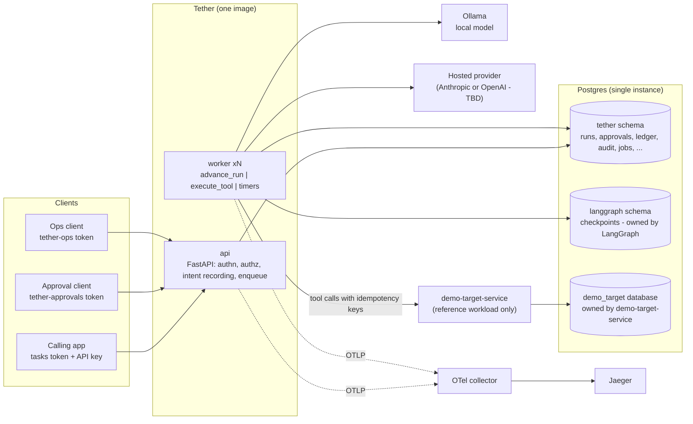
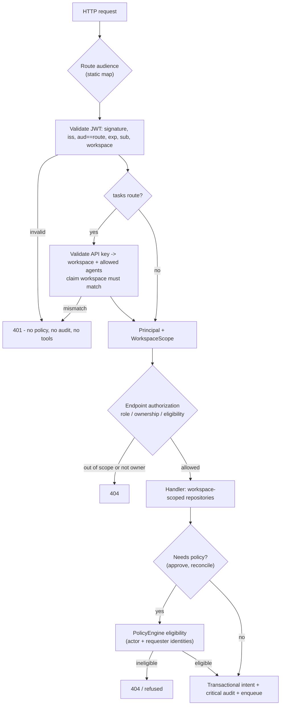
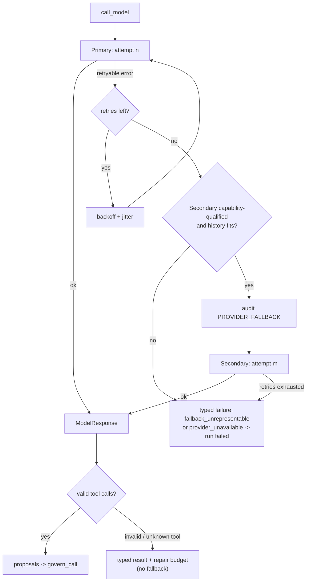
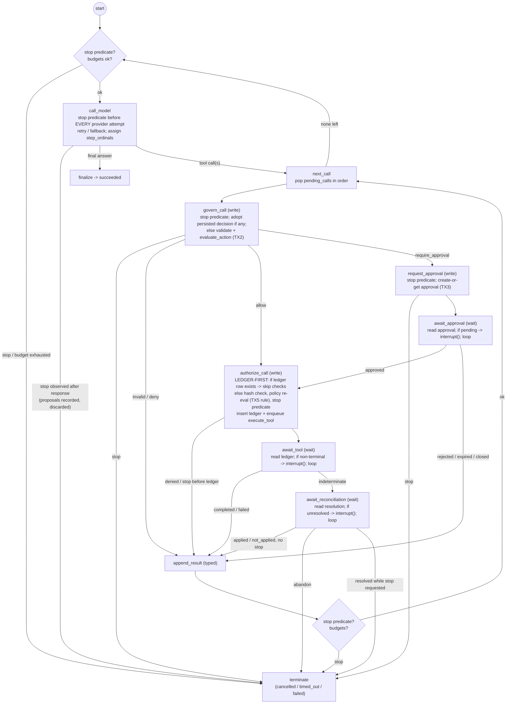
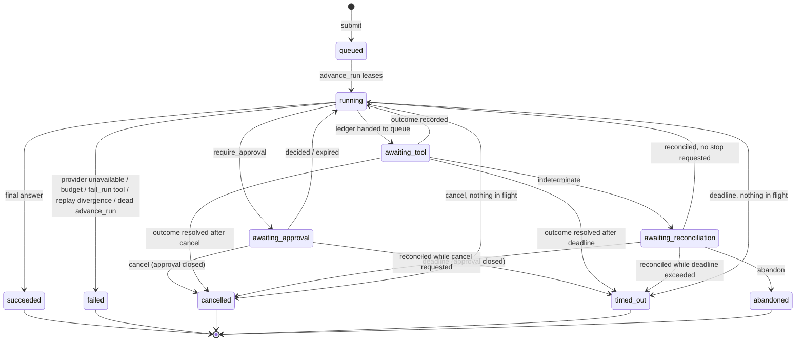
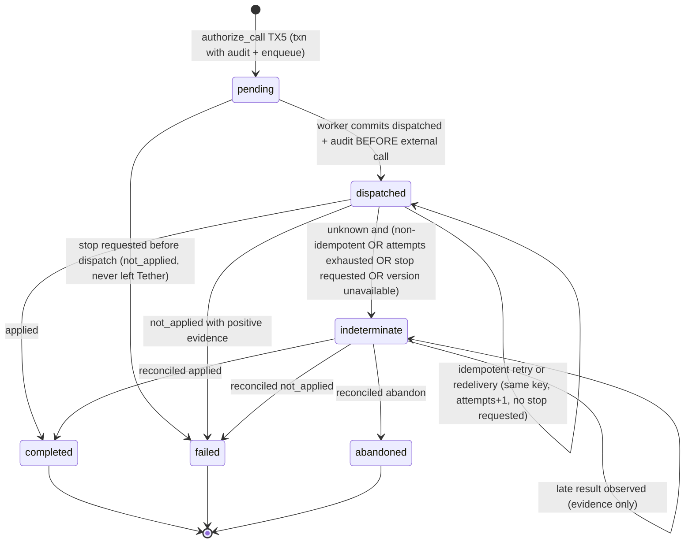
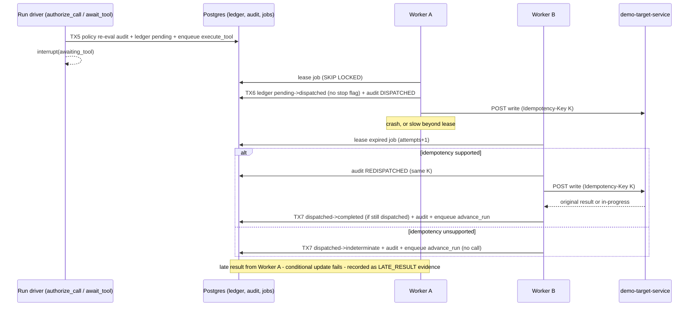
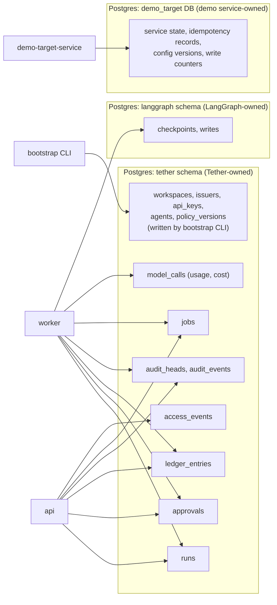
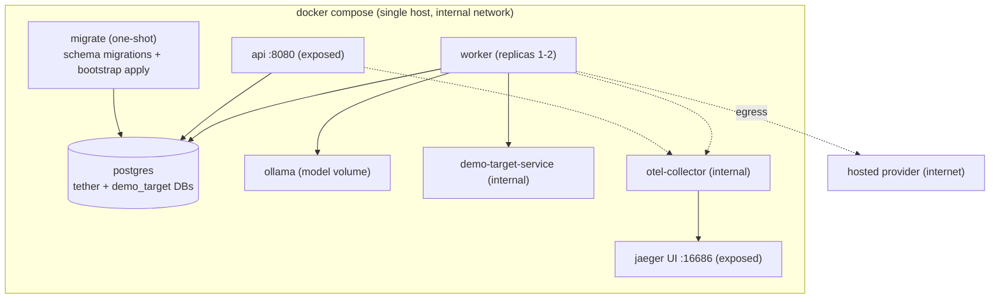
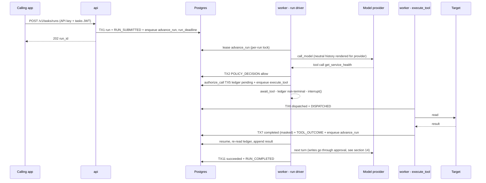

# Tether V1 — System Architecture

> **Input:** frozen V1 PRD — [`.claude/PRPs/prds/tether-runtime.prd.md`](../../.claude/PRPs/prds/tether-runtime.prd.md).
> **Scope:** high-level architecture only. No implementation plans or code. Decisions marked **AD-xx** and the §24 candidates are recorded as ADRs in [`docs/adr/`](../adr/README.md).
> **Status:** revised after architect review (`ecc:architect`) — 2026-10-06. Review disposition in §27.
> **Amended 2026-10-08:** §9.3 step 3 resumes with an opaque sentinel instead of `Command(resume=None)` (S1.3 contract finding; ADR-0003 unchanged).

---

## 0. Reading guide

| § | Topic |
|---|-------|
| 1 | Architectural drivers (what the PRD forces) |
| 2 | System / container architecture and process topology |
| 3 | Tether ↔ LangGraph ownership |
| 4 | Repository, package, and module boundaries |
| 5 | Identity, authentication, authorization, workspace isolation |
| 6 | Policy evaluation |
| 7 | Tool registry and `ToolSource` |
| 8 | Provider abstraction, neutral history, retry/fallback |
| 9 | LangGraph state and execution graph |
| 10 | Run lifecycle state machine |
| 11 | Postgres job queue, leasing, timers |
| 12 | Execution ledger, outcome classification, idempotency |
| 13 | Transaction boundaries and replay safety |
| 14 | Approvals |
| 15 | Reconciliation, cancellation, timeout |
| 16 | Audit chain, access events, observability |
| 17 | Secrets and sensitive-data boundaries |
| 18 | Data ownership and storage |
| 19 | Deployment topology (Docker Compose) |
| 20 | Future replaceability seams |
| 21 | Resolution of the ten open architecture questions |
| 22 | Architectural invariants |
| 23 | Traceability to PRD guarantees and tests |
| 24 | ADR candidates |
| 25 | Questions deferred to planning |
| 26 | Contradiction check against the PRD |
| 27 | Architect review disposition |

Each major decision uses the format **Problem → How → Why over the alternative → Failure behaviour**.

---

## 1. Architectural drivers

1. **Every side effect is governed, durable, and honest** — policy before dispatch; no duplicate supported writes; unknown outcomes never reported as failures; critical audit before side effects.
2. **LangGraph owns graph mechanics; Tether owns production semantics** — Tether must not reimplement checkpointing/interrupts, and LangGraph must not be trusted with side-effect correctness.
3. **Crash anywhere, lose nothing** — API or worker may die at any instruction; runs resume; replays are safe.
4. **Identity and workspace boundaries are fail-closed** on every endpoint and record.
5. **Small footprint** — Postgres is the only stateful dependency; ~10 concurrent runs; single node; ~$50/month.
6. **Domain independence** — workloads plug in through a public SDK surface; core never imports them.

---

## 2. System / container architecture

### AD-01 — Two Tether processes from one image: `api` and `worker`

- **Problem:** Tools must not run in the API process (PRD); graph execution must survive API restarts; we must not add infrastructure beyond the PRD's Compose list.
- **How:** One Python image, two entrypoints.
  - **`api`** (FastAPI): authenticates, authorizes, and *records intent* — submissions, approval decisions, reconciliations, cancellations — then enqueues work. It never runs graph nodes, calls models, or executes tools.
  - **`worker`**: leases jobs from the Postgres queue and runs three job families: `advance_run` (drives the LangGraph graph, calls models, evaluates policy), `execute_tool` (runs tools via the registry), and timer jobs (`expire_approval`, `run_deadline`). Scale by replicas.
- **Why over the alternative:** A third "runner" service (graph driver separate from tool executor) gives stronger isolation but adds a container and inter-process hops with no V1 requirement behind it; the job-family split already allows separating them later by deploying workers that lease only some job kinds. Running graphs inside the API couples run progress to HTTP process health.
- **Failure:** If `api` dies, in-flight HTTP requests fail and clients retry; no run state is lost (all intent is transactional). If `worker` dies, leases expire and jobs are redelivered (§11–13). If all workers are down, runs pause (no progress, no loss) and timers fire late but are also enforced at decision time (§11.4).



---

## 3. Tether ↔ LangGraph ownership

| Concern | Owner | Architectural consequence |
|---------|-------|---------------------------|
| Graph definition (nodes, edges, routing) | **Tether** defines | `tether.runtime.graph` builds a `StateGraph` |
| Graph execution, state propagation | **LangGraph** | Invoked only from `advance_run` jobs |
| Checkpointing (Postgres saver) | **LangGraph** | `langgraph` schema; Tether never writes it directly |
| Interrupt / resume primitives | **LangGraph** | Used for approval, tool-result, and reconciliation waits |
| What a checkpoint *means* | **Tether** | Checkpoint = *progress cache*. Authoritative side-effect state lives in Tether tables (AD-10) |
| Tool contracts, policy, approvals, identity, retries/fallback, ledger, audit, observability, secrets | **Tether** | Separate modules (§4) invoked from nodes or API |

**Rule:** no LangGraph API is used for side-effect correctness. LangGraph decides *where the graph is*; Tether tables decide *what has happened in the world*.

---

## 4. Repository, package, and module boundaries

### AD-02 — Core / SDK / workload layering with enforced import contracts

- **Problem:** Workloads must register through public interfaces; core must never depend on workloads (T-14).
- **How:** `src/tether/` is the runtime. `tether.sdk` is the **only** surface workloads may import (tool decorator, `ToolOutcome`, schema annotations such as `Sensitive`, policy-rule API, agent registration). Workloads are discovered by name from bootstrap config via Python entry points (`tether.workloads`), so core never imports them statically. Import contracts (e.g. import-linter) run in CI: `tether.* ↛ workloads.*`, `workloads.* → tether.sdk only`.
- **Why over the alternative:** A shared "plugins" folder inside core blurs the boundary and makes T-14 a code-review convention instead of a machine check.
- **Failure:** A forbidden import fails CI. A workload failing to load at startup fails worker/api startup (fail closed), not silently.

### Proposed directory structure

```text
Tether-Runtime/
├── pyproject.toml
├── src/tether/
│   ├── sdk/              # PUBLIC surface for workloads (tool decorator, ToolOutcome, Sensitive, policy-rule API)
│   ├── core/             # pure domain: ids, canonical JSON + hashing, value objects, errors (no I/O)
│   ├── identity/         # JWT validation, API keys, Principal, IssuerKeyProvider (static now, OIDC later)
│   ├── authz/            # route→audience map, endpoint authorization rules, WorkspaceScope
│   ├── policy/           # PolicyEngine protocol, built-in evaluator, policy versioning
│   ├── registry/         # Tool, ToolDescriptor, ToolSource protocol, NativePythonToolSource, manifest
│   ├── providers/        # ModelProvider protocol, neutral history, capability model, adapters/{ollama,hosted}
│   ├── runtime/          # LangGraph state model, graph builder, nodes, run driver
│   ├── ledger/           # ledger repository, state machine, idempotency keys, outcome classification
│   ├── approvals/        # approval records, eligibility, expiry
│   ├── reconciliation/   # reconciliation commands and rules
│   ├── audit/            # per-run HMAC chain append/verify, access events
│   ├── queue/            # JobQueue protocol, PostgresJobQueue, delayed jobs, dead-letter hooks
│   ├── secrets/          # SecretsProvider protocol, env impl, masking/redaction engine
│   ├── storage/          # DB engine, Unit of Work, workspace-scoped repositories, migrations
│   ├── observability/    # OTel setup, trace-context persistence, metrics, JSON logging
│   ├── api/              # FastAPI app; routers: tasks/, approvals/, ops/
│   ├── worker/           # worker entrypoint, job handlers
│   ├── cli/              # bootstrap apply, audit verify
│   └── testing/          # scripted model provider (test-only, refuses to load outside test env)
├── workloads/
│   └── incident_remediation/
│       ├── tools.py  policy.py  agent.py
│       ├── runbooks/*.md
│       └── scenarios/    # scripted tool-call sequences for F1–F11
├── services/demo_target_service/   # separate app + Dockerfile; not part of Tether
├── tools/dev_issuer/               # dev-only token minting (outside the runtime image)
├── config/bootstrap/               # declarative workspaces, issuers, API keys, agents, policies (dev examples)
├── deploy/compose/                 # docker-compose.yml, otel-collector config
├── tests/{unit,integration,authz,chaos,perf,architecture}/
└── docs/architecture/
```

### Component responsibility table

| Component | Responsibility | Must never |
|-----------|----------------|-----------|
| `api` routers (tasks / approvals / ops) | Authn, audience check, authz, workspace scoping; record intent transactionally; enqueue | Run graph nodes, call models, execute tools |
| `identity` | Validate JWTs and API keys; build `Principal` | Trust caller-supplied roles, agent IDs, or workspace |
| `authz` | Map route → audience; apply endpoint authorization table; produce `WorkspaceScope` | Return 403 for out-of-scope resources (must be 404) |
| `policy` | `allow`/`deny`/`require_approval`; approval and reconciliation eligibility | Read model-supplied risk/permission fields |
| `registry` | Tool descriptors, schema validation, manifest for providers | Execute tools in the API process |
| `providers` | Neutral history ↔ provider format; retries; fallback; capability checks | Truncate history silently |
| `runtime` (graph + nodes) | Drive the run (wake protocol, `durability="sync"`); write nodes create-or-get hash-checked rows; wait nodes check-then-interrupt | Perform external side effects directly; re-authorize a call that already has a ledger row |
| `ledger` | Logical executions, state machine, idempotency keys, outcome classification | Redeliver a non-idempotent dispatched job |
| `queue` | At-least-once jobs, leases, delayed jobs, dead-letter transitions (TX12) | Guarantee exactly-once (never assumed); coalesce wake jobs |
| `audit` | Critical events, per-run HMAC chain, dedupe; access events (async) | Buffer critical events asynchronously |
| `secrets` | Secret access; masking of sensitive fields; log scrubbing | Persist unmasked sensitive output |
| `storage` | UoW transactions; workspace-scoped repositories | Allow an unscoped query from request paths |
| `observability` | Spans, metrics, logs; persisted trace context | Be the source of truth for reconstruction |
| `worker` handlers | `advance_run`, `execute_tool`, `expire_approval`, `run_deadline` | Transition run status except via the run driver (§10) |
| `testing.scripted` | Deterministic tool-call sequences for CI | Load when `TETHER_ENV != test` |
| `demo-target-service` | Unhealthy service with fault injection, idempotency keys, preconditions | Be imported by Tether |

---

## 5. Identity, authentication, authorization, workspace isolation

### AD-03 — Route-bound audiences, static platform-controlled issuer keys

- **Problem:** Tokens must not be reusable across risk classes; the calling app must not mint approver identities; agents must be server-resolved.
- **How:**
  - Each router is statically bound to one audience: `/v1/tasks/*` → `tether-tasks`, `/v1/approvals/*` → `tether-approvals`, `/v1/ops/*` → `tether-ops`. The **expected audience comes from the route, never the token.**
  - Issuer verification keys per workspace come from bootstrap config through an `IssuerKeyProvider` (static now; JWKS/OIDC later). Separate keys per audience are supported; the demo uses a separate approver key.
  - Validation: signature (pinned algorithms), `iss` ∈ workspace issuers, `aud` == route audience, `exp`/`nbf`, `sub` present, `workspace` claim present.
  - Tasks routes additionally require an API key: stored as a salted hash; maps to exactly one workspace and an allowed agent set; `workspace` claim must match; requested agent must be in the set.
  - Result: an immutable `Principal {subject, workspace_id, audience, roles, token_id}` and, for tasks, `CallerApp {api_key_id, allowed_agents}`.
- **Why over the alternative:** Reading the audience from the token and then authorizing by role lets a high-privilege token work on any endpoint; route binding makes cross-audience reuse impossible by construction.
- **Failure:** Any validation failure → `401` before any policy evaluation, audit write, or tool activity (T-18). Unknown workspace / out-of-scope resource → `404`.

### AD-04 — Workspace-scoped repositories (application-level isolation)

- **Problem:** Workspace match must be enforced on every read/write/approval/reconciliation/cancel (non-slippable).
- **How:** Request handlers never receive a raw DB session. They receive repositories constructed with a `WorkspaceScope` (from `Principal`); every query includes `workspace_id = :scope`. Lookups by ID return "not found" when the row exists in another workspace → `404`. Worker-side code derives scope from the job's `workspace_id` and verifies it matches the run.
- **Why over the alternative:** Postgres row-level security is stronger defence-in-depth but adds session-variable plumbing and migration complexity; at V1 scale application scoping plus the T-24 matrix (with `fixture-b`) is sufficient. RLS is recorded as a future hardening option.
- **Failure:** A missing scope is a programming error caught by construction (repositories cannot be built without a scope) and by T-24.



**Requester identity:** at submission the validated `sub`, roles, and workspace are snapshotted into `runs.requester_snapshot`; the token itself is never stored. Policy re-evaluation later uses this snapshot plus current policy.

---

## 6. Policy evaluation

### AD-05 — `PolicyEngine` protocol with three decision points and versioned policy

- **Problem:** One engine must decide tool actions, approval eligibility, and reconciliation eligibility; built-in now, Cedar/OPA later; decisions must be attributable to a policy version.
- **How:** Protocol methods:
  - `evaluate_action(input) → Decision{allow|deny|require_approval, reasons, policy_version}` — input: requester snapshot, agent identity, workspace, `ToolDescriptor` (risk, effect, required permissions — **from the registry only**), canonical call hash, run metadata.
  - `evaluate_approval_eligibility(approver, requester, approval) → bool`
  - `evaluate_reconciliation_eligibility(reconciler, requester, ledger_entry) → bool`

  The built-in evaluator is deny-by-default over workspace-registered rules (core rules + workload rules such as `oncall` and separation of duties). Policies are loaded from bootstrap config; each loaded set has a content hash = `policy_version`, recorded in every decision's audit event. Current policy is the workspace's **active** `policy_version` row; a decision transaction in a process whose loaded version differs records no decision (job re-queued without consuming an attempt, or HTTP 503) and the stale process restarts (ADR-0009).
- **Why over the alternative:** Hard-coding approval/reconciliation rules in endpoint code would bake domain rules (SoD) into core and make Cedar/OPA migration a rewrite.
- **Failure:** Evaluator exception or missing policy → `deny` (fail closed) with an audited reason.

**Evaluation points in a run:** (1) proposal time in `govern_call`; (2) **again before the ledger entry is created** in `authorize_call` (current policy, snapshot identity), with the TX5 mapping rule — `deny` overrides any approval, `require_approval` needs a matching approved approval, `allow` proceeds; (3) approval decision time (eligibility); (4) reconciliation time (eligibility).

---

## 7. Tool registry and `ToolSource`

- **`ToolDescriptor`** (from workload code via `tether.sdk`): name, version, description, input model, output model (with `Sensitive` field annotations), `effect` (`read`/`write`), `risk`, required permissions, `idempotency` (`supported`/`unsupported`), optional `precondition` fields, retry budget, timeout, `on_exhausted` (`typed_failure`/`fail_run` — reads only).
- **`ToolSource` protocol:** `list_tools(workspace) → [ToolDescriptor]`, `resolve(name, version) → ExecutableTool`. V1 implementation: `NativePythonToolSource`. MCP later is another `ToolSource`; its tools pass through the identical govern/execute path.
- **Manifest:** the registry renders a provider-neutral tool manifest (name, description, input JSON schema) for the active agent's allowed tools; adapters translate it.
- **Tool result contract:** tools return `ToolOutcome.applied(output)`, `ToolOutcome.not_applied(reason, evidence)`, or raise. The framework classifies (§12.3).

---

## 8. Provider abstraction, neutral history, retry/fallback

### AD-06 — Provider-neutral history with capability-qualified fallback

- **Problem:** Mid-run fallback must work across providers with different tool-call formats and context sizes, without silent truncation.
- **How:**
  - **Neutral history** (Tether Pydantic models, stored in graph state): `system`, `user`, `assistant{text, tool_calls[{call_id, tool, arguments}]}`, `tool_result{call_id, outcome: applied|not_applied|failed|denied|invalid|rejected|expired|reconciled|skipped, payload_masked}`. Only masked payloads ever enter history.
  - **`ModelProvider` protocol:** `capabilities() → {tool_calling, parallel_tool_calls_controllable, context_window_tokens}`, `complete(history, manifest, settings) → ModelResponse{text | tool_calls, usage}`. Adapters own translation (call IDs, roles, tool schema format).
  - **Retry/fallback inside `call_model`:** retry the primary on retryable errors (timeouts, 5xx, 429) with exponential backoff and jitter up to its budget; then try the secondary **only if** it is capability-qualified and the rendered history fits its context window (token estimate with safety margin). Each turn starts with the primary again.
  - **Not provider failures:** schema-invalid calls, unknown tools, policy denials → typed results + repair/denial budget (§9).
- **Why over the alternative:** Storing provider-native transcripts makes fallback a lossy conversion at the worst moment; sticky fallback would hide primary recovery and skew cost.
- **Failure:** If both providers fail → run terminal `failed` (reason `provider_unavailable`), audited. If history does not fit the secondary → typed `fallback_unrepresentable` failure, never truncation. Model calls repeated by a crash-replay are both recorded (truthful audit and cost; §13.3).



---

## 9. LangGraph state and execution graph

### 9.1 State shape (checkpointed; Pydantic)

| Field | Purpose |
|-------|---------|
| `run_id`, `workspace_id`, `agent_id` | Identity of the run (immutable) |
| `history: list[NeutralMessage]` | Provider-neutral conversation; masked tool payloads only |
| `pending_calls: list[ProposedCall]` | Calls from the latest model turn not yet governed; each has a **stable `step_ordinal`**, `call_id`, tool, arguments, `call_hash` |
| `current: ProposedCall \| None` | Call being governed/executed |
| `next_step_ordinal: int` | Monotonic counter, assigned in `call_model`. The run graph is compiled/invoked with LangGraph **`durability="sync"`**, so `call_model`'s checkpoint is durable before any downstream node creates an authoritative row (LangGraph's default `async`/`exit` modes would violate this) |
| `turn_ordinal`, `steps_used`, `repair_used`, `denials_used` | Budgets (max steps, repair/denial budget) |
| `trace_context` | W3C `traceparent` of the run root (also stored in `runs`) |

Not in state: run status, cancel/deadline flags, approval/ledger outcomes, unmasked tool output, tokens. Those live in Tether tables and are **re-read** by nodes.

### 9.2 Graph

Write nodes (create authoritative rows, never interrupt) are separated from wait nodes (only read and interrupt). This shrinks the replay surface: a wait node re-executed on resume performs no checks and no writes.



- **Ledger-first rule (F-02):** once a ledger row exists for `(run_id, step_ordinal)`, authorization is a recorded, one-time decision; no node re-runs policy, hash, or stop checks for it. **A stop flag on a run with a non-terminal ledger entry means wait (in `await_tool` / `await_reconciliation`), never terminate.**
- **No DRAIN branch:** calls are governed sequentially and `await_tool` only exits on a terminal or `indeterminate` ledger state, so at `G1` no ledger entry can be non-terminal. This is asserted, not branched on.
- **Multi-call remainder (ADR-0012):** `next_call` proceeds to call k+1 only if call k's final result is `applied` (automatic or reconciled as applied); any other final result gives each remaining call a typed `skipped` result (decision-class audit event; no validation, policy, approval, or ledger). `require_approval`, `awaiting_tool`, and `awaiting_reconciliation` pause the sequence; they never skip it.
- **Stop predicate (F-06):** `cancel_requested_at IS NOT NULL OR clock_timestamp() >= runs.deadline_at` (`deadline_at` is stored at submission). It is evaluated at `G0`, before every provider attempt including retries and fallback, immediately after `call_model` returns (proposals received after a stop are recorded for cost but never governed), and at the top of `govern_call`, `request_approval`, and `authorize_call` (before a ledger row exists). Linearization point: a model request started before the stop commit became visible is not a "further" call.
- **Interrupt reasons:** `awaiting_approval`, `awaiting_tool`, `awaiting_reconciliation`. **Resume values and job payloads carry no meaning** — wait nodes take the approval/ledger reference from graph state and re-read the authoritative row (§9.3).

### 9.3 Run-driver wake protocol (F-04)

1. **Lease, then lock.** The worker leases an `advance_run` job, then takes a **session-level advisory lock** on the run using a dedicated connection held for the whole invocation (released in `finally`). If the lock is contended, the job is returned to `ready` with a short delay **without incrementing `attempts`** — never completed. The advisory lock is the per-run mutex; it is load-bearing, not belt-and-braces. Heartbeat or lock-connection failure aborts the invocation. After acquiring the lock the driver increments the run's driver generation and uses it as a fencing token: every run-driver write (TX2, TX3, TX5, TX11, TX12, and other node decision events) asserts it under the run-row lock and aborts on mismatch; a fenced invocation releases its job without completing it (ADR-0005).
2. **Terminal check.** If the run is terminal, complete the job as a no-op.
3. **Invocation choice.** No checkpoint → invoke with the initial input built from `runs`. Pending interrupt(s) → resume with `Command(resume=<sentinel>)`. Checkpoint with non-empty `next` and no interrupt (crash mid-step) → `invoke(None)`. Otherwise → reconcile status via a TX11 finalize.
   - **Resume sentinel.** Tether resumes with an opaque, non-semantic constant, currently `"tether:wake"`. It carries no business or domain meaning: wait nodes ignore it and always re-read the authoritative row (ADR-0003, unchanged). `Command(resume=None)` is not used, because on the pinned LangGraph version `None` is not a valid resume. The S1.3 contract suite pins both facts (`tests/contract/langgraph/README.md`).
4. **Check before interrupt.** Every wait node checks its authoritative condition **before** calling `interrupt()`, interrupts only if unsatisfied, and loops on spurious wakes. A duplicate or early wake is therefore a no-op.
5. **Payloads.** `advance_run` jobs carry only `run_id`. Duplicate `advance_run` jobs are harmless and are **not** coalesced (F-01).

---

## 10. Run lifecycle state machine

### AD-07 — Single status writer with stop flags

- **Problem:** Cancellation, timeout, reconciliation, and graph progress race; terminal states must be immutable; unknown outcomes must never be hidden.
- **How:** `runs.status` is written **only by the run-driver module**: inside a graph invocation (`advance_run`), or by its dead-letter function (TX12) when an `advance_run` job exhausts its attempts. The only other write is the initial `queued` insert in TX1. The API and timers write *requests*: `cancel_requested_at/by`, `deadline_exceeded_at` (the deadline itself, `deadline_at`, is fixed at submission), approval/reconciliation rows. Every status transition is a conditional update (`WHERE status = :expected`); a DB trigger rejects changes to `status` once terminal (other columns unaffected; TX9/TX10 against a terminal run are no-ops). Status names below are proposals (PRD leaves naming to architecture). There is no separate `stopping` status: a stop request while a write is in flight is displayed as `awaiting_tool` + stop flag.
- **Why over the alternative:** Letting API endpoints write terminal statuses directly creates lost-update races with an in-flight graph and makes "never resume after cancel" depend on timing.
- **Failure:** A crash between deciding and writing a transition is replayed; conditional updates make transitions idempotent.



Terminal records carry an outcome summary (e.g. `cancelled` + "in-flight write reconciled as applied"), so a reconciled cancellation is never reported as clean. While a stop is requested and an `indeterminate` entry exists, the visible status is `awaiting_reconciliation` (PRD precedence rule).

---

## 11. Postgres job queue, leasing, timers

### AD-08 — Postgres job table with leases, delayed jobs, dead-letter transitions, and an advisory-lock per-run mutex

- **Problem:** At-least-once dispatch transactional with ledger/audit writes; no Redis; timers without occupying compute.
- **How:**
  - `jobs(id, kind, workspace_id, run_id, ref_id, payload, run_after, state[ready|leased|done|dead], lease_token, lease_expires_at, attempts, max_attempts, concurrency_key, trace_parent, created_at)`.
  - **Enqueue** happens inside the caller's transaction (same Unit of Work as ledger/audit) — the job table is its own transactional outbox.
  - **Lease:** `SELECT … FOR UPDATE SKIP LOCKED` on `ready` (or `leased` with an expired lease) where `run_after <= clock_timestamp()`; set a new `lease_token`, `lease_expires_at`, `attempts += 1`. Handlers heartbeat to extend long leases. Completion and failure are conditional on `lease_token`.
  - **Wake-up:** polling (~250 ms) in V1; `LISTEN/NOTIFY` is an optional latency optimization, not required (queue latency is outside P-01).
  - **Per-run serialization:** the **session-level advisory lock** held by the run driver (§9.3) is the per-run mutex. `concurrency_key = run_id` may be used as a lease-query optimization only; it is not relied upon for mutual exclusion (it is not atomic across concurrent leasers).
  - **No coalescing (F-01):** duplicate `advance_run` jobs are allowed and are no-ops by the wake protocol. A coalescing `ON CONFLICT DO NOTHING` insert takes no lock on the existing ready row, so a concurrent lease could consume it before the event transaction commits and strand the run. **Invariant:** every state-changing event transaction (TX4, TX6r when it moves an entry to `indeterminate`, TX-EA, TX7, TX8, TX9, TX10, TX12) inserts its own wake job, which cannot be leased before that transaction commits.
  - **Bounded delivery:** when `attempts > max_attempts`, the job is marked `dead` **in the same transaction** as a kind-specific dead-letter transition (TX12, §13.1), so exhaustion always yields a domain outcome and a wake.
- **Why over the alternative:** Redis would add a dependency and break the single-transaction guarantee (requiring a separate outbox relay). A cron sweeper for timers duplicates leasing logic that delayed jobs already provide.
- **Failure:** Worker crash → lease expiry → redelivery, governed per job kind (below). DB unavailable → nothing progresses; nothing is lost.

| Job kind | Redelivery safety |
|----------|-------------------|
| `advance_run` | Safe by replay-safety rules (§13.3) and the wake protocol (§9.3); exhaustion → TX12 (run `failed`/`system_error`, or `awaiting_reconciliation` if a non-terminal or `indeterminate` ledger entry exists) |
| `execute_tool` | Governed by ledger state and tool idempotency (§12); exhaustion → TX12 (`pending → failed` not_applied; `dispatched → indeterminate` for writes / typed failure for reads) |
| `expire_approval` / `run_deadline` | Idempotent conditional updates that re-check current state; no-ops on terminal runs |

### 11.4 Timers (approval expiry, run deadline)

- On approval creation, enqueue `expire_approval(approval_id)` with `run_after = expires_at`. On submission, store `runs.deadline_at = created_at + max_duration` and enqueue `run_deadline(run_id)` with `run_after = deadline_at`.
- **Decision-time enforcement:** approve/reject refuses when `clock_timestamp() >= expires_at`; the stop predicate (§9.2) compares `clock_timestamp()` with the stored `deadline_at`, so guards, TX2/TX3/TX5, and TX6 enforce the deadline even if the timer job has not run yet (e.g. workers were down). The timer job only materialises state (approval → `expired`; run → `deadline_exceeded_at`, pending approvals → closed) and enqueues `advance_run`. `clock_timestamp()` (not `now()`, which is transaction start) is used for all time checks.

---

## 12. Execution ledger, outcome classification, idempotency

### 12.1 Ledger entry

One row per **logical execution**: `ledger_entries(id, workspace_id, run_id, step_ordinal, tool, tool_version, effect, idempotency_support, call_hash, idempotency_key, state, attempts, outcome_payload_masked, outcome_reason, resolution, resolved_by, justification, created_at, …)` with `UNIQUE(run_id, step_ordinal)`. Reads use the ledger too (uniform replay behaviour; reads never become `indeterminate`).

### 12.2 State machine (PRD names retained)



`resolution` (`automatic` | `reconciled_applied` | `reconciled_not_applied` | `reconciled_abandon`) and `resolved_by` distinguish human outcomes from automatic ones.

### 12.3 Outcome classification (answers open question 9)

| Signal from tool execution | Classification | Ledger result |
|----------------------------|----------------|---------------|
| `ToolOutcome.applied(output)` | `applied` | `completed` |
| `ToolOutcome.not_applied(reason, evidence)` — definitive rejection (precondition mismatch, validation rejection by the target) | `not_applied` | `failed` |
| Failure provably before any request bytes left Tether (connection refused, DNS failure, stop flag before dispatch) | `not_applied` | `failed` |
| Timeout, connection reset after send, ambiguous 5xx, any uncaught exception after dispatch, worker death after `dispatched` | `unknown` | idempotent and attempts left → retry with the **same key**; otherwise `indeterminate` |

Definitive rejections are declared by the **tool author** via `ToolOutcome.not_applied`; the framework's default for anything else after dispatch is `unknown` (conservative). Read tools that exhaust retries yield a typed failure (or `fail_run` per descriptor).

**Idempotent unknown vs `not_applied`:** an idempotent write whose attempts all time out is *not* `not_applied` — the target may have applied it. It becomes `indeterminate` (F8 / T-20). Only positive evidence produces `not_applied`.

### AD-09 — Deterministic idempotency keys

- **Problem:** Replays, retries, and redeliveries must present the same key; legitimately new executions must get a new key.
- **How:** `idempotency_key = "tth_" + base32(SHA-256(JCS([run_id, step_ordinal, call_hash])))` (unambiguous encoding), computed when the ledger row is created and stored on it. `step_ordinal` comes from synchronously checkpointed state (`durability="sync"`), so a replayed node recomputes the same key and hits `UNIQUE(run_id, step_ordinal)` (create-or-get, with call-hash comparison — AD-10). A re-proposal after `not_applied` or rejection is a new model turn → new `step_ordinal` → new key → fresh policy and approval.
- **Why over the alternative:** Random keys held only in the checkpoint are lost if the crash precedes the checkpoint; keys from the call hash alone collide when a model legitimately repeats an identical action later in the run.
- **Failure:** If a target's key-retention window is shorter than recovery time, a redelivery could re-apply; V1's demo target retains keys durably; documented for future integrations.

### 12.4 Dispatch, crash recovery, overlapping deliveries



- Before TX6 the worker verifies `hash(payload arguments) == ledger.call_hash`; a mismatch fails the job without dispatch (`pending → failed`).
- **Outcome commits** are conditional only on `state = 'dispatched'` (first definitive outcome wins) and always enqueue a wake. **Job completion** is conditional on `lease_token`; a token mismatch (expired lease) never rolls back the outcome — the outcome commits and the job row is left to its current lessee, which will find the ledger terminal and complete as a no-op. A late definitive result after `indeterminate` is recorded as an evidence event for the reconciler and **does not auto-resolve** (PRD: human reconciliation required).
- Retries within one delivery (transient errors) and redeliveries (lease expiry) share the key and the attempt counter; exhausting `max_attempts` with an unknown outcome → `indeterminate`. Every re-send first commits a stop-gated re-dispatch record (ledger still `dispatched`, stop predicate false as in TX6, `attempts+1`, audit `REDISPATCHED`); if the stop predicate is true, nothing is re-sent and the entry becomes `indeterminate` (reads: typed failure) in that transaction (ADR-0008).

---

## 13. Transaction boundaries and replay safety

### AD-10 — Tether tables are authoritative; the checkpoint is a progress cache

- **Problem:** LangGraph's checkpoint write and Tether's writes cannot share one transaction (the saver manages its own connection); LangGraph re-runs a node from the start on resume and from the last checkpoint after a crash.
- **How:**
  - The run graph runs with **`durability="sync"`**: each step's checkpoint is durable before the next step starts, so `step_ordinal`s and proposals are fixed before any downstream authoritative row is created (F-03).
  - Every node write is **create-or-get by deterministic key** (`(run_id, step_ordinal)` for approvals/ledger; `(run_id, dedupe_key)` for decision audit events). **Every "get" compares the stored `call_hash` with the current call's hash**; a mismatch is a replay divergence → fail closed (audit `REPLAY_DIVERGENCE`; run → `failed`, after any in-flight ledger entry has drained to an outcome or reconciliation).
  - Every node decision that depends on the world re-reads Tether tables. Nodes never perform external side effects; only `execute_tool` jobs do, and only after `dispatched` is committed.
- **Why over the alternative:** Sharing a connection/transaction with the checkpointer couples Tether to LangGraph internals and still would not cover the external call; making the checkpoint authoritative would lose side-effect facts on a pre-checkpoint crash.
- **Failure:** Crash after a Tether transaction but before the next checkpoint → the node replays → create-or-get returns the existing rows (hash-checked) → same outcome. A divergent replay can never attach one call's outcome to another call.

### 13.1 Transaction catalogue (answers open question 5)

| # | Transaction | Process | Contents (atomic) |
|---|-------------|---------|-------------------|
| TX1 | Submit | api | `runs` row (requester snapshot, trace context) + audit `RUN_SUBMITTED` (chain genesis) + enqueue `advance_run` + enqueue `run_deadline` |
| TX2 | Proposal decision | worker (`govern_call`) | `SELECT runs … FOR SHARE`; refuse if stop predicate true; get-or-create audit `POLICY_DECISION` or `CALL_INVALID` (decision class, keyed by step_ordinal — on replay the **persisted decision is adopted**, not re-decided); typed results live in state |
| TX3 | Request approval | worker (`request_approval`) | `SELECT runs … FOR SHARE`; refuse if stop predicate true; create-or-get `approvals` row (pending, call_hash, expires_at) + audit `APPROVAL_REQUESTED` + enqueue `expire_approval` |
| TX4 | Approval decision | api | lock run row; conditional `pending → approved/rejected` (not expired, run not stop-requested, eligible) + audit `APPROVAL_DECIDED` (approver, policy_version) + enqueue `advance_run` |
| TX5 | Authorize execution | worker (`authorize_call`) | **Only if no ledger row exists.** If the pinned `tool_version` is not resolvable → typed `not_applied`, no ledger (ADR-0011). `SELECT runs … FOR SHARE`; refuse if stop predicate true; re-evaluate current policy and map: `deny` → typed denied result, no ledger; `require_approval` → proceed only if an `approved` approval exists for `(run, ordinal)` with equal `call_hash` and `clock_timestamp() < expires_at` (an approved but lapsed approval → typed `expired`, ADR-0011), otherwise route to `request_approval`; `allow` → proceed. On proceed: insert ledger `pending` (idempotency key) + audit `EXECUTION_AUTHORIZED` (re-evaluated decision, `approval_id`, `policy_version`) + enqueue `execute_tool` **only if the INSERT returned a row** |
| TX6 | Dispatch commit | worker (`execute_tool`) | conditional `pending → dispatched` (run not stop-requested, deadline not passed; else `pending → failed`, cancelled before dispatch) + audit `DISPATCHED` (attempt) — **committed before the external call** |
| TX6r | Re-dispatch gate (ADR-0008) | worker (`execute_tool`) | before every re-send (retry or redelivery): conditional on ledger still `dispatched` and stop predicate false → `attempts+1` + audit `REDISPATCHED`, committed before the re-send; if the stop predicate is true → no re-send, `dispatched → indeterminate` (reads: typed failure) + audit + enqueue `advance_run` |
| TX-EA | Approval expiry (timer, §11.4) | worker (`expire_approval`) | conditional `pending → expired` + audit + enqueue `advance_run`; no-op if already decided or run terminal |
| TX7 | Outcome commit | worker (`execute_tool`) | conditional (on `state='dispatched'` only) `dispatched → completed/failed/indeterminate` + masked outcome + audit `TOOL_OUTCOME` + enqueue `advance_run`; complete the job only if `lease_token` matches (mismatch never rolls back the outcome) |
| TX8 | Reconcile | api | lock run row; conditional `indeterminate → resolution` + justification + audit `RECONCILED` + enqueue `advance_run` |
| TX9 | Cancel | api | lock run row; set `cancel_requested_*` + close pending approvals + audit `CANCEL_REQUESTED` and `APPROVAL_CLOSED` (each) + enqueue `advance_run` |
| TX10 | Deadline | worker (timer) | set `deadline_exceeded_at` + close pending approvals + audits + enqueue `advance_run` |
| TX11 | Status transition | worker (run driver) | conditional `runs.status` update + audit `RUN_STATUS_CHANGED` (terminal: `RUN_COMPLETED` with outcome summary) |
| TX12 | Dead-letter | worker (queue, same txn that marks the job `dead`) | `execute_tool`: `pending → failed` (not_applied — no call is reachable without TX6) or `dispatched → indeterminate` (writes) / typed failure (reads) + audit `TOOL_OUTCOME` + enqueue `advance_run`. `advance_run`: run-driver dead-letter function, under the run's advisory lock, transitions the run to `failed`/`system_error`, or to `awaiting_reconciliation` if a non-terminal or `indeterminate` ledger entry exists, + audit |

If any critical audit append fails, the enclosing transaction rolls back and no side effect follows (fail closed). Model-call records (usage/cost, **including failed attempts**) are written in their own small transaction after each provider attempt; they are authoritative for cost and retry reconstruction but are not side-effect authorization events.

**Lock order (deadlock avoidance):** run row → approval/ledger row → audit head → jobs.

### 13.2 Ordering rule

`approval decided (TX4)` → `policy re-evaluated + ledger pending (TX5)` → `dispatched (TX6)` → **external call** → `outcome (TX7)`. No external call is reachable without TX5 and TX6 having committed.

### 13.3 Replay safety (answers open question 7)

| Node | Kind | Replay behaviour |
|------|------|------------------|
| `call_model` | write (model I/O) | May re-call the provider after a pre-checkpoint crash. Safe: proposals are inert until checkpointed (sync durability); every attempt is recorded with a per-occurrence key (truthful audit and cost). |
| `govern_call` | write | If a decision event exists for the ordinal (hash-checked), **adopt it**; otherwise validate, evaluate, TX2. |
| `request_approval` | write | Create-or-get approval (hash-checked); never a second approval. |
| `await_approval` | wait | Reads approval; interrupts only while pending; no writes, no checks. |
| `authorize_call` | write | **Ledger-first:** if a ledger row exists (hash-checked), skip all checks; otherwise TX5. |
| `await_tool` | wait | Reads ledger; interrupts only while non-terminal; a stop flag never short-circuits it. |
| `await_reconciliation` | wait | Reads ledger resolution and stop flags. |
| `finalize` / `terminate` | write | Conditional status update; no-op if already terminal. |

**Audit dedupe classes (F-08):**
- **Decision events** (`POLICY_DECISION`, `CALL_INVALID`, `APPROVAL_REQUESTED`, `EXECUTION_AUTHORIZED`, `RECONCILED`, status transitions) use deterministic keys and are create-or-get; on replay the node adopts the persisted decision. This is safe because TX5 re-evaluates current policy before any side effect.
- **Observation events** (model attempts, `PROVIDER_FALLBACK`, `DISPATCHED`/`REDISPATCHED` attempts, `LATE_RESULT`) use per-occurrence keys (attempt number or a UUID minted before the I/O), so genuine repeats are never dropped.

---

## 14. Approvals

### AD-11 — Canonical call hash (answers open question 4)

- **Problem:** Approvals must bind the exact action; serialization must be stable across processes, retries, and library versions.
- **How:** `call_hash = HMAC-SHA-256(K_bind[key_id], JCS(envelope))` using **RFC 8785 JSON Canonicalization Scheme**, where `K_bind` is a call-binding key from `SecretsProvider` (distinct from the audit key) pinned to the run before its first hash (ADR-0010), where `envelope = {v: 1, workspace_id, run_id, agent_id, tool, tool_version, arguments, preconditions}`. `arguments` are the **validated** input model dumped in JSON mode and **unmasked** (the hash binds the real action); the model-generated `call_id` and rationale are excluded. Guidance: write-tool argument schemas avoid binary floats (integers or decimal strings); strings are hashed as given (no Unicode normalisation in V1).
- **Why over the alternative:** Ad-hoc `json.dumps(sort_keys=True)` differs across number formatting and escaping rules; hashing raw model output would bind unvalidated text instead of the action actually executed.
- **Failure:** Any change to tool, version, arguments, or preconditions changes the hash → approval invalid (T-08).

```mermaid
sequenceDiagram
  participant D as Run driver
  participant DB as Postgres
  participant AP as api (tether-approvals)
  participant B as Approver (bob)
  participant TM as Timer job

  D->>DB: TX3 create-or-get approval(call_hash, expires_at) + audit + enqueue expire_approval
  D-->>D: interrupt(awaiting_approval) - no compute held
  B->>AP: GET /v1/approvals (approvals token)
  AP->>DB: list approvals bob is eligible for (own requests excluded)
  B->>AP: POST /v1/approvals/{id}/approve
  AP->>DB: TX4 lock run; pending, not expired, no stop predicate, eligible; audit; enqueue advance_run
  DB-->>D: advance_run leased - resume(approval_id)
  D->>DB: await_approval re-reads approval; authorize_call: verify call_hash, TX5 rule (require_approval needs this approved approval) + ledger + enqueue
  alt no decision before expiry
    TM->>DB: expire_approval - pending->expired + audit + enqueue advance_run
    DB-->>D: resume - typed expired result
  end
```

- **Approval detail view** (masked): canonical call (tool, version, masked arguments, `call_hash`), precondition values, requester, expiry, model rationale labelled *untrusted*, link to run evidence.
- **Stale world (preconditions):** tools declare precondition fields (e.g. `expected_config_version`), which are part of the hash; the **target** enforces them at execution. A mismatch → `not_applied` (definitive) → typed result (F10 / T-21). Tether does not attempt world-state checks itself.

---

## 15. Reconciliation, cancellation, timeout

```mermaid
sequenceDiagram
  participant W as Worker (execute_tool)
  participant DB as Postgres
  participant D as Run driver
  participant AP as api (tether-ops)
  participant RC as Reconciler (dave)

  W->>DB: TX7 dispatched->indeterminate (unknown) + audit + enqueue advance_run
  DB-->>D: resume(ledger_id)
  D->>DB: status -> awaiting_reconciliation
  D-->>D: interrupt(awaiting_reconciliation)
  RC->>AP: POST /v1/ops/ledger/{id}/reconcile {outcome, justification}
  AP->>DB: TX8 lock run; eligible (not requester); indeterminate->resolution + audit RECONCILED + enqueue advance_run
  DB-->>D: resume
  alt stop requested (cancel or deadline)
    D->>DB: TX11 terminal cancelled / timed_out with reconciled outcome - no model call
  else abandon
    D->>DB: TX11 terminal abandoned
  else applied or not_applied
    D->>D: typed result appended - loop continues (new proposals need fresh policy/approval)
  end
```

**Cancellation (TX9) and deadline (TX10):** both set a stop flag and close pending approvals atomically under the run-row lock (`FOR UPDATE`). TX2/TX3/TX5 take `FOR SHARE` on the run row and refuse when the stop predicate is true, so a new proposal decision, approval, or ledger entry cannot slip in after a stop commits. A concurrent approval (TX4) either commits first — and the subsequent dispatch is then blocked at TX5 or TX6 by the stop predicate (`failed`, not applied) — or is refused. Writes already `dispatched` are not recalled; `await_tool` keeps waiting for their outcome (a stop flag never short-circuits a non-terminal ledger entry). No re-send starts once the stop is visible: an attempt already in flight may still record a definitive outcome, but an unknown outcome (or a pending re-send) becomes `indeterminate` immediately and routes to reconciliation (ADR-0008). After any stop, the stop predicate prevents further model calls or proposals; reconciliation then only records the outcome and terminates (answers open question 10).

---

## 16. Audit chain, access events, observability

### AD-12 — Per-run HMAC chain with dedupe and head locking

- **Problem:** Tamper evidence per run without cross-run contention; idempotent appends under replay; write-ahead before side effects.
- **How:** `audit_heads(run_id, seq, last_mac, key_id)` and `audit_events(workspace_id, run_id, seq, dedupe_key, event_type, actor, tool, payload_masked, policy_version, trace_id, created_at, prev_mac, mac, key_id)` with `UNIQUE(run_id, seq)`, `UNIQUE(run_id, dedupe_key)`, and indexes on `(workspace_id, actor)`, `(workspace_id, tool)`, `(workspace_id, created_at)` for the PRD's audit queries. Append inside the caller's transaction: lock the run's head row `FOR UPDATE` → if `dedupe_key` exists, return it (dedupe classes: §13.3) → `mac = HMAC-SHA256(K[key_id], JCS({workspace_id, run_id, seq, event_type, actor, tool, payload_masked, policy_version, created_at, prev_mac}))` → insert → advance head. The key comes from `SecretsProvider` and is never stored in the DB; `key_id` allows rotation. `tether audit verify` recomputes chains.
- **Why over the alternative:** A global chain serialises all runs; unkeyed hashes can be recomputed by anyone with DB write access.
- **Failure:** Append failure aborts the enclosing transaction (fail closed). Detects in-place edits and reordering without the key; does **not** detect tail truncation or whole-run deletion (documented V1 limit; future external anchor).

**Access events** (run inspection, audit queries) go to `access_events` asynchronously via a small buffered writer; not chained; loss on crash is acceptable by PRD decision.

### AD-13 — Authoritative reconstruction vs best-effort traces (answers open question 6)

- **Problem:** Killed processes lose buffered spans; a run spans days and many processes.
- **How:** `GET /runs/{id}` assembles the timeline from `runs`, `audit_events`, `ledger_entries`, `approvals`, and `model_calls` — never from Jaeger. Traces: at submission a trace ID and root span context are created and stored as `runs.trace_parent`; every job row carries `trace_parent`; each job handler starts a span whose parent is the stored context (with a link to the enqueuing span), so every segment of a run shares one trace ID across restarts. Audit events store `trace_id` for correlation. Logs are JSON with `run_id`/`trace_id` and a redaction processor. Metrics go via OTLP to the collector (no Prometheus/Grafana in V1).
- **Why over the alternative:** Treating traces as the record would make T-12 fail every chaos test; a trace per segment without a shared ID loses run-level correlation.
- **Failure:** Lost spans degrade diagnostics only; authoritative reconstruction is unaffected.

---

## 17. Secrets and sensitive-data boundaries

### AD-14 — Single masking choke point; masked-only persistence of outputs

- **Problem:** Secrets and sensitive tool fields must never reach model context, inspection, logs, traces, audit, or approval displays.
- **How:**
  - `SecretsProvider.get(name) → SecretValue` (masked `repr`); known secret values are registered with the log/trace scrubber.
  - **Outputs:** the worker's `ToolResultSanitizer` masks `Sensitive` fields **before** TX7, so unmasked sensitive output is never persisted or placed into history/checkpoints.
  - **Inputs:** arguments are hashed unmasked (binding) but stored/displayed masked in audit, approvals, logs, and inspection; unmasked values exist only in the model-produced history and in the job payload needed to execute the call.
  - Hosted-provider egress: only masked tool output is ever sent to a model (the PRD egress note applies to non-sensitive data).
  - **Leak paths closed by configuration:** Pydantic models use `hide_input_in_errors=True` so validation errors (which feed `CALL_INVALID` audit, logs, and model context) never echo inputs; LangSmith/LangChain tracing is disabled; graph state and `jobs.payload` are never logged.
- **Why over the alternative:** Redacting at each sink (logs, API, audit) misses new sinks; masking at the source is one tested boundary.
- **Failure:** A tool that mislabels a field leaks it — mitigated by T-16 and review of `Sensitive` annotations; checkpoint encryption at rest is post-V1.

---

## 18. Data ownership and storage



| Data | Owner / writer | Readers | Notes |
|------|----------------|---------|-------|
| Workspaces, issuers, API-key hashes, agents, agent bindings, policy versions | Bootstrap CLI | api, worker | Declarative; no admin API |
| `runs` (status, requester snapshot, `deadline_at`, stop flags, trace_parent) | Status: run-driver module only (plus initial `queued` in TX1). Stop flags: api/timer | api (scoped), worker | Trigger blocks `status` changes once terminal |
| `approvals` | Created by run driver; decided by api; expired/closed by timer/api | api, worker | `UNIQUE(run_id, step_ordinal)` |
| `ledger_entries` | Created by run driver; dispatch/outcome by worker; resolution by api | api, worker | `UNIQUE(run_id, step_ordinal)`, `UNIQUE(idempotency_key)` |
| `audit_heads` / `audit_events` | Any writer of a critical transaction | api (auditor/admin), verify CLI | Append-only (no UPDATE/DELETE grants on events) |
| `jobs` | Enqueue: api/worker; lease/complete: worker | worker | Transactional outbox |
| `model_calls` | Worker | api (timeline, cost) | Authoritative usage/cost; one row per attempt, including failures |
| `access_events` | api (async) | api (auditor/admin) | Not chained |
| LangGraph checkpoints | LangGraph saver (worker) | worker | Progress cache; never read by the API |
| demo-target state | demo-target-service | demo-target-service, chaos tests | Separate database; not Tether data |

Migrations: Tether schema via a migration tool; LangGraph schema via the saver's own setup; both run by a one-shot `migrate` container before `api`/`worker` start.

---

## 19. Deployment topology (Docker Compose)



- Secrets (HMAC key, hosted-provider API key, issuer *public* keys) via Docker secrets/env files. **Issuer private keys are not deployed with Tether**; a dev-only token-minting tool (outside the runtime image) issues demo tokens, using a separate approver key, so the calling app holds only `tether-tasks` tokens.
- `worker` replicas = 2 in chaos tests to exercise overlapping deliveries (C-07).
- No Prometheus, Grafana, Redis, or Kubernetes in V1.

---

## 20. Future replaceability seams (interfaces only)

| Future | Seam | Note |
|--------|------|------|
| Redis / other queue | `JobQueue` protocol | Non-Postgres queues need a transactional outbox relay because enqueue currently shares the ledger transaction |
| MCP | `ToolSource` | MCP tools get descriptors (risk, permissions, idempotency) from config, never from the server |
| OIDC | `IssuerKeyProvider` / token validator | JWKS fetch + revocation; audiences unchanged |
| Cedar / OPA | `PolicyEngine` | Three decision methods map to policy queries |
| Vault / cloud secrets | `SecretsProvider` | Includes the HMAC key with `key_id` rotation |
| Kubernetes | Stateless `api`/`worker` + `migrate` job | No local state outside Postgres/Ollama volumes |
| Audit anchoring / WORM | `AuditAnchor` hook (not implemented) | Periodic head export would address truncation |
| Row-level security | Repository layer | Defence-in-depth behind `WorkspaceScope` |

---

## 21. Resolution of the ten open architecture questions

| # | Question | Resolution | Section |
|---|----------|------------|---------|
| 1 | How LangGraph waits for worker execution | **Dispatch-and-interrupt:** `authorize_call` commits ledger + job (TX5); `await_tool` checks the ledger and calls `interrupt()` only while it is non-terminal; the worker's outcome transaction (TX7) inserts its own `advance_run` wake job; the run driver resumes per the wake protocol and re-reads the ledger. No process blocks. | §9.2, §9.3, §12.4 |
| 2 | Scheduling expiry/timeout without compute | Delayed jobs (`run_after`) in the same queue + decision-time enforcement | §11.4 |
| 3 | Parallel tool calls | Adapters disable parallel calls where the provider allows. Any multi-call response is processed **sequentially in returned order**, each call independently validated, policy-checked, approved, and ledgered; never a batch approval. Calls k+1…n continue only if call k's final result is `applied`; otherwise each receives a typed `skipped` result; `require_approval` pauses rather than skips (ADR-0012). A scripted multi-call scenario covers it. | §9 |
| 4 | Canonical serialization | RFC 8785 JCS over a versioned envelope of validated arguments; HMAC-SHA-256 under the run's pinned call-binding key (ADR-0010) | §14 |
| 5 | Transaction boundaries | TX1–TX12 catalogue (TX12 = dead-letter); critical audit inside the same transaction as the state change it authorizes; every event transaction inserts its own wake job; fixed lock order | §13.1 |
| 6 | Trace context across restarts | `trace_parent` persisted on `runs` and every job; shared trace ID; traces best-effort | §16 |
| 7 | Node replay safety | `durability="sync"`; write/wait node split; ledger-first authorization; create-or-get with call-hash comparison; decision adoption; check-before-interrupt; no side effects in nodes | §9.2, §9.3, §13 |
| 8 | Run lifecycle | Run-driver module is the only status writer (graph or TX12 dead-letter), stop predicate with stored `deadline_at`, terminal status immutability; state diagram | §10 |
| 9 | Idempotent unknown vs `not_applied` | Only positive evidence → `not_applied`; exhausted unknown → `indeterminate` even for idempotent tools | §12.3 |
| 10 | Reconciliation after cancel/timeout | Guards block model calls after a stop flag; reconciliation records outcome and terminates | §15 |

### Normal governed execution flow



---

## 22. Architectural invariants (must never be violated)

1. No external side effect occurs unless TX5 (policy re-evaluation + ledger `pending`) and TX6 (`dispatched` + audit) have committed.
2. Graph nodes never perform external side effects; only `execute_tool` jobs do.
3. Every node write is create-or-get by a deterministic key **and compares the stored `call_hash`**; a mismatch fails closed. Every world-dependent decision re-reads Tether tables.
4. A non-idempotent `dispatched` entry is never re-sent; lease expiry, worker death, or delivery exhaustion → `indeterminate`.
5. `not_applied` requires positive evidence; unknown outcomes after exhausted attempts → `indeterminate` for every side-effecting tool.
6. Retries and redeliveries of one logical execution reuse its idempotency key; new logical executions get new keys.
7. Critical audit events are appended inside the transaction that changes the authorizing state; append failure aborts it.
8. Only the run-driver module writes `runs.status` (graph invocation or TX12), apart from the initial `queued` insert; terminal statuses never change.
9. After the stop predicate becomes true, no model call starts and no tool proposal is governed; reconciliation then only records and terminates.
10. At most one `advance_run` executes per run at a time, enforced by a session-level advisory lock; a contended job is re-queued without consuming an attempt.
11. Policy inputs (risk, permissions, effect, approval requirement) come only from the registry, bootstrap policy, and validated identity — never from model output.
12. The expected audience is determined by the route; a token is never accepted on another audience's route.
13. Every request-path query is workspace-scoped; out-of-scope resources return 404.
14. Unmasked sensitive tool output is never persisted, logged, traced, or sent to a model.
15. Approvals bind the canonical hash of validated arguments; any change invalidates them.
16. Expiry and deadlines are enforced at decision time, not only by timer jobs.
17. Postgres (not traces) is the source of truth for run reconstruction.
18. Core packages never import `workloads/`; workloads import only `tether.sdk`.
19. The scripted provider cannot load outside the test environment.
20. Fallback never truncates history; unrepresentable state is a typed failure.
21. The run graph uses LangGraph `durability="sync"`.
22. **Ledger-first:** once a ledger row exists for a call, no policy, hash, or stop check runs for it again; a stop flag with a non-terminal ledger entry means wait, never terminate.
23. Every state-changing event transaction inserts its own wake job; `advance_run` jobs are never coalesced.
24. Wait nodes check their authoritative condition before `interrupt()`; resume values and job payloads carry no meaning.
25. Job exhaustion always yields a domain transition in the same transaction (TX12).
26. TX5 maps `require_approval` to "proceed only with a matching approved approval"; a tightened policy can never skip approval.
27. Decision audit events are create-or-get and adopted on replay; observation events are per-occurrence.
28. TX2, TX3, and TX5 take `FOR SHARE` on the run row and refuse when the stop predicate is true; TX4, TX8, TX9, and TX10 take `FOR UPDATE`.
29. All time comparisons use `clock_timestamp()`; the deadline is the stored `runs.deadline_at`.
30. Every run-driver authoritative write asserts the run's current driver fencing token under the run-row lock; a stale token aborts the invocation without writing (ADR-0005).
31. A policy decision or eligibility answer is recorded only if the evaluating process's loaded `policy_version` equals the workspace's active version, read in the same transaction; otherwise nothing is decided (ADR-0009).
32. Calls after call k of a model turn are governed only if call k's final result is `applied`; otherwise each receives a typed `skipped` result; `require_approval` pauses, never skips (ADR-0012).
33. A call executes only under its pinned `tool_version`: unresolvable before dispatch → `not_applied`; needed for a re-send after dispatch → `indeterminate` (writes). An approved approval authorizes TX5 only before its `expires_at` (ADR-0011).
34. Call hashes are HMAC-SHA-256 under the run's pinned call-binding key, distinct from the audit key; the key never enters the database (ADR-0010).
35. No external send (first or re-send) starts unless a committed gate transaction observed the stop predicate false; after a stop, a dispatched write with an unknown outcome becomes `indeterminate` without a re-send (ADR-0008).

---

## 23. Traceability to PRD guarantees and tests

| PRD guarantee / test | Architectural mechanism |
|----------------------|-------------------------|
| Risky write blocked until approval (T-01, T-06–T-08, T-19) | §14 approval flow; invariants 1, 15; policy re-evaluation in TX5 |
| Identity & trust boundary (T-18, T-19) | AD-03 route-bound audiences, API-key agent binding |
| Read-side & human-action authz, workspace enforcement (T-24) | AD-03, AD-04, endpoint table; `fixture-b` workspace |
| Reconciliation & cancellation (T-25, T-26) | §15, AD-07, stop predicate before every provider attempt and write node, `FOR SHARE`/`FOR UPDATE` serialization, await_tool never short-circuited by stop, TX8–TX10 |
| Durable runs (C-01–C-03) | §13 replay safety (`durability="sync"`, hash-checked create-or-get); §9.3 wake protocol; per-event wake jobs; TX12 dead-letter |
| No duplicate supported writes (C-04–C-07) | §12.4 ledger + same-key redelivery; ledger-first authorization; conditional outcome commits independent of lease token |
| Honest ambiguous writes (T-17, T-20, C-07) | §12.3 classification; invariants 4, 5 |
| Stale-world protection (T-21) | Preconditions in the hash, enforced by the target |
| Provider swap & fallback (T-10, T-11) | AD-06 neutral history + capability-qualified fallback |
| Model-output handling (T-22) | Repair/denial budget in `govern_call`; not a provider failure |
| Untrusted input / injection (T-23) | Invariant 11; masked canonical args vs untrusted rationale |
| Sensitive-data containment (T-16) | AD-14 single choke point |
| Reconstructability (T-12) | AD-13 authoritative timeline |
| Tamper evidence (T-13) | AD-12 per-run HMAC chain |
| Domain independence (T-14) | AD-02 import contracts |
| Approval expiry (T-15) | §11.4 delayed jobs + decision-time check |
| Overhead < 100 ms p95 (P-01) | Per-run head lock (no global contention); in-process policy; single-transaction audit |
| Concurrency / pending approvals (P-02, P-03) | Interrupt-based waits hold no compute; SKIP LOCKED leasing |

---

## 24. ADR candidates (next stage)

All items are recorded in [`docs/adr/`](../adr/README.md); the mapping is in the ADR index.

1. AD-01 Process topology (`api` + `worker`, job families)
2. AD-02 Core / SDK / workload layering and import contracts
3. AD-03 Route-bound audiences, issuer key provider, API-key agent binding
4. AD-04 Workspace-scoped repositories (RLS deferred)
5. AD-05 PolicyEngine decision points and policy versioning via bootstrap
6. AD-06 Provider-neutral history, capability-qualified fallback, per-turn primary retry
7. AD-07 Run lifecycle: single status writer, stop flags, terminal immutability
8. AD-08 Postgres job queue: leasing, delayed jobs, advisory-lock per-run mutex, no coalescing, dead-letter transitions (TX12)
9. AD-09 Deterministic idempotency keys
10. AD-10 Authoritative Tether tables vs checkpoint progress cache (replay model)
11. AD-11 Canonical call hash (RFC 8785 envelope)
12. AD-12 Per-run HMAC audit chain, dedupe, key rotation
13. AD-13 Authoritative reconstruction and trace-context persistence
14. AD-14 Sensitive-data masking choke point
15. Dispatch-and-interrupt waiting model (§21 Q1)
16. Sequential governance of multi-call model responses (§21 Q3)
17. Ledger outcome classification and late-result evidence handling (§12.3–12.4)
18. Bootstrap configuration + CLI as the only admin surface
19. Run-driver wake protocol and `durability="sync"` (§9.3)
20. **A-01** Meaning of "current policy" — **Decided in ADR-0009** (active `policy_version` row; a mismatched process records no decision and restarts; policy change = redeploy)
21. **A-02** Fencing a zombie run driver — **Decided in ADR-0005** (per-run driver generation as fencing token on every run-driver write; abort on heartbeat/lock loss)
22. **A-03** Remaining calls in a multi-call turn — **Decided in ADR-0012** (continue only after `applied`; otherwise typed `skipped`; `require_approval` pauses)
23. **A-04** Tool-version semantics and approval window — **Decided in ADR-0011** (pinned version; unresolvable → `not_applied` before dispatch / `indeterminate` after; approval usable only before `expires_at`)
24. **A-05** Keyed call hash — **Decided in ADR-0010** (HMAC-SHA-256 with a per-run pinned `SecretsProvider` key, distinct from the audit key)
25. **A-06** Post-stop idempotent redelivery — **Decided in ADR-0008** (no re-send after a stop is visible; unknown → `indeterminate`)

---

## 25. Questions safe to defer to planning

- Library choices: DB driver and query layer; migration tool; JWT library; structured logging library; import-contract tool.
- Default numbers: lease duration and heartbeat interval; polling interval; backoff parameters; max delivery attempts; max steps; repair/denial budget; token-estimation safety margin.
- Exact status enum names and API response schemas (timeline, approval detail, audit-query pagination).
- API-key hashing scheme and rotation procedure; HMAC key rotation runbook.
- Coexistence of Tether migrations with the LangGraph saver's setup; LangGraph version pinning.
- Scripted-provider scenario format; chaos harness mechanism (container kill vs in-process fault hooks).
- Pricing-table source and format (PRD open question); Ollama model choice and pre-pull strategy (PRD open question).
- `demo-target-service` API shape and idempotency-record retention.
- JCS integer range: keep argument integers within ±2^53; preconditions declared as a subset of arguments.
- Advisory-lock connection management and heartbeat cadence (§9.3); lease-token handling in TX7 (§12.4).

---

## 26. Contradiction check against the PRD

No contradiction requiring a PRD revision was found. Clarifications made within PRD latitude:

- **Model calls may repeat on crash-replay** (pre-checkpoint crash in `call_model`). Both calls are audited and costed; consistent with reconstructability and the cost model; no side effect can follow an un-checkpointed proposal.
- **Reads also use the ledger and the worker.** The PRD requires tools to run in the worker; using the ledger for reads adds uniform replay behaviour without changing any guarantee (reads never become `indeterminate`).
- **Ledger states keep the PRD's names** (`pending`, `dispatched`, `completed`, `failed`, `indeterminate`), with `resolution` recording human outcomes and an entry-level `abandoned` terminal for the `abandon` reconciliation outcome.
- **Late definitive results after `indeterminate`** are recorded as evidence and never auto-resolve, preserving the PRD rule that `indeterminate` requires human reconciliation.
- **Graph driving runs in the worker container**, alongside tool execution. The PRD requires only that tools not run in the API process; separating the driver from the tool executor remains possible via job-kind routing.
- **"No further model calls after cancellation"** is satisfied with an explicit linearization point (§9.2): a model request started before the stop commit became visible is not a further call. The architect review confirmed this needs no PRD revision.
- **Unmasked arguments in checkpoints and job payloads** are not a PRD violation: the PRD's sinks are model context (the model produced those arguments), inspection (the API never reads checkpoints), logs, traces, audit, and approval displays; checkpoint encryption is explicitly post-V1.

---

## 27. Architect review disposition

Review by `ecc:architect` (2026-10-06) against the frozen PRD. No `PRD REVISION REQUIRED` finding.

| ID | Class | Finding | Disposition |
|----|-------|---------|-------------|
| F-01 | BLOCKER | Coalescing `ON CONFLICT DO NOTHING` can lose a wakeup and strand a run | **Applied** — coalescing removed; every event transaction inserts its own wake job (§11, invariant 23) |
| F-02 | BLOCKER | `execute_call` re-ran stop/policy checks before reading the ledger on resume, hiding in-flight/applied outcomes | **Applied** — write/wait node split, ledger-first rule (§9.2, §13.3, invariant 22) |
| F-03 | BLOCKER | Replay premise assumed synchronous checkpoints; LangGraph default is async | **Applied** — `durability="sync"`; call-hash comparison on every get; replay divergence fails closed (AD-10, invariants 3, 21) |
| F-04 | IMPORTANT | Wake/resume protocol unspecified | **Applied** — §9.3 wake protocol; advisory lock is the mutex (invariants 10, 24) |
| F-05 | IMPORTANT | Exhausted jobs had no domain transition | **Applied** — TX12 dead-letter transitions (§11, §13.1, invariant 25) |
| F-06 | IMPORTANT | Stop/deadline checks incomplete | **Applied** — stop predicate with stored `deadline_at`, checked before every provider attempt and at write nodes; TX2/TX3/TX5 `FOR SHARE` (§9.2, §11.4, §15, invariants 9, 28, 29) |
| F-07 | IMPORTANT | TX5 mis-mapped re-evaluation results | **Applied** — explicit TX5 mapping rule (§13.1, §6, invariant 26) |
| F-08 | IMPORTANT | Replayed decisions could diverge from deduped audit | **Applied** — decision vs observation dedupe classes; decisions adopted on replay (§13.3, invariant 27) |
| A-01…A-06 | ADR DECISION | Current-policy propagation, zombie driver fencing, multi-call remainder, tool_version/approval window, keyed call hash, post-stop idempotent redelivery | **Decided** — ADR-0009 (A-01), ADR-0005 (A-02), ADR-0012 (A-03), ADR-0011 (A-04), ADR-0010 (A-05), ADR-0008 (A-06) |
| D-01 | IMPL. DETAIL | TX7 outcome must not depend on lease token | **Applied** (§12.4, TX7) |
| D-02 | IMPL. DETAIL | Trigger scope; TX1 `queued` exception; TX9/TX10 no-op on terminal | **Applied** (AD-07) |
| D-03 | IMPL. DETAIL | `clock_timestamp()` for time checks | **Applied** (§11.4, invariant 29) |
| D-04 | IMPL. DETAIL | Global lock order | **Applied** (§13.1) |
| D-05 | IMPL. DETAIL | `audit_events.workspace_id` + query indexes, in MAC | **Applied** (AD-12) |
| D-06 | IMPL. DETAIL | Unambiguous idempotency-key encoding | **Applied** (AD-09) |
| D-07 | IMPL. DETAIL | `hide_input_in_errors`, tracing off, never log payloads | **Applied** (AD-14) |
| D-08 | IMPL. DETAIL | Record failed model attempts | **Applied** (§13.1, §18) |
| D-09 | IMPL. DETAIL | Session-level advisory lock on dedicated connection | **Applied** (§9.3) |
| D-10 | IMPL. DETAIL | JCS integer range | **Deferred to planning** (§25) |
| D-11 | IMPL. DETAIL | Worker verifies payload hash before TX6 | **Applied** (§12.4) |
| S-* | Simplification | Drop coalescing; advisory lock as sole mutex; node split; drop `stopping`; remove DRAIN; polling-only queue | **Applied** — none weakens a PRD guarantee |
| — | LATER | RLS behind `WorkspaceScope`; external audit anchor | Unchanged (§20) |

---

**Status after architect review:** all BLOCKER and IMPORTANT findings applied (§27); ADR-decision items A-01–A-06 decided in ADR-0005, ADR-0008, ADR-0009, ADR-0010, ADR-0011, and ADR-0012.
